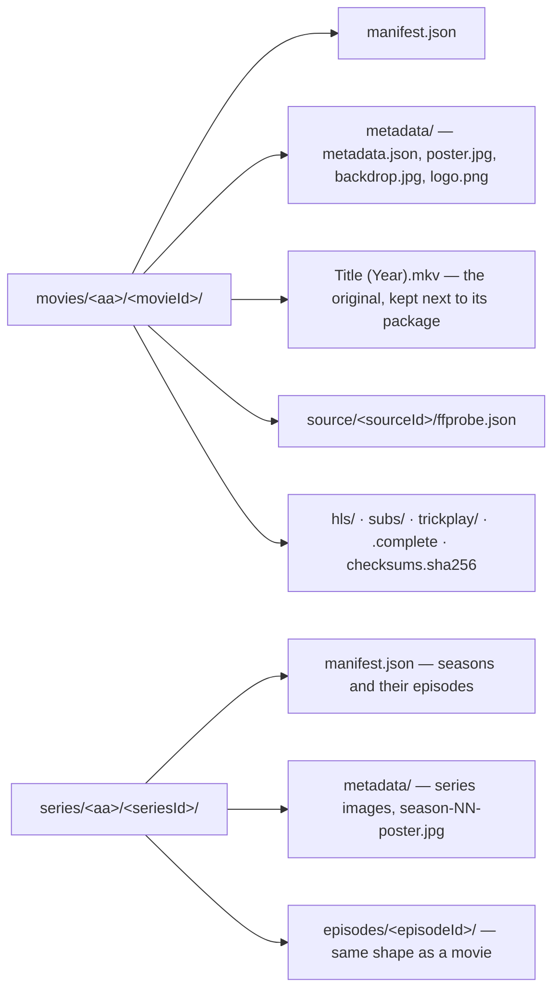

# schemas

Published contracts for the zaentrum platform, in two families:

- **Event payloads** — Avro schemas for Kafka events, the single source of
  truth for event shapes, published to a shared Apicurio schema registry.
- **Library storage** — JSON Schemas for the on-storage library, served at
  <https://zaentrum.github.io/schemas/>, in two versions: [v1](#library-storage-schemas), where
  storage is the source of truth and every item is a `manifest.json` plus a
  `metadata/metadata.json`, and [v2](#library-storage-schemas--v2), where the database is the
  working copy and the tree is a written-once record that can rebuild it.

## Status

The Avro schemas cover five event domains: library item lifecycle, transcode
processing, playback sessions, download-gateway adapters, and push-notification
fan-out. The library storage schemas are a draft; see their changelog below.

## Layout

```
stube/
  library/    item lifecycle events (created/updated/deleted)
  processing/ transcoder task + result events
  playback/   session lifecycle from chino-stream / tv-stream / musig-stream
  download/   download-gateway adapter completion events
  notify/     fan-out push notification requests
library/v1/
  manifest.schema.json, metadata.schema.json, defs.schema.json
  examples/                a movie and a series in the storage layout
library/v2/
  item.schema.json, metadata.schema.json, source.schema.json,
  version.schema.json, package.schema.json, event.schema.json, defs.schema.json
  examples/                a movie, a series and a deletion in the record layout
tools/
  publish-to-apicurio.sh           publish Avro schemas to a registry
  validate-library.py              validate a v1 library tree
  test-validate-library.py         broken v1 trees the validator must reject
  library-migrate.py               reference migrator from a legacy catalog
  make-library-examples.py         regenerate library/v1/examples
  package-checksums.py             write or verify each package's checksums on storage
  validate-library-v2.py           validate a v2 library tree
  test-validate-library-v2.py      broken v2 trees the validator must reject
  make-library-v2-examples.py      regenerate library/v2/examples
```

The top-level `stube/` directory mirrors the Avro namespace and Kafka topic
prefix (`stube.<domain>`); it is an operational name and is kept as-is.

## Naming convention

- Topic: `stube.<domain>.<event>` (e.g. `stube.library.item.created`).
- Avro namespace: `stube.<domain>` (mirrors directory).
- Avro record name: `PascalCase` (`ItemCreated`, `TaskTranscode`).
- Artifact id in the registry: dot-joined path without extension
  (e.g. `stube.library.item-created`).

## Local development

Validate every schema parses as JSON:

```bash
find stube -name '*.avsc' -print0 | xargs -0 -I{} python -c "import json,sys; json.load(open('{}'))"
```

Or, if you have `avro-tools`:

```bash
find stube -name '*.avsc' -exec avro-tools compile schema {} /tmp/avro-gen \;
```

## Publishing

`tools/publish-to-apicurio.sh` walks every `.avsc` and publishes it to an
Apicurio registry. Point it at your own registry via environment variables:

```bash
APICURIO_URL=https://apicurio.example/ GROUP_ID=zaentrum ./tools/publish-to-apicurio.sh
```

## Library storage schemas

`library/` holds JSON Schemas (draft 2020-12) for the platform's on-storage
library, where storage is the source of truth and databases would be caches
built by reading it. The format is ahead of the code: no platform service reads
or writes it yet. Every item is a folder with two documents:

| Document | What it holds |
|---|---|
| `manifest.json` | The entry point. What the item is (type, primary title, reference ids), the playback fields a streaming service reads (unchanged from the version 2 package manifest), and for every version of a movie or episode what the original file contained and what the package carries and lost. |
| `metadata/metadata.json` | Every text (localised titles, overviews, credits, dates, series and season details) and the list of images, which sit in the same `metadata/` folder. A re-sync from the reference database would rewrite only this file. |

Layout on storage:



`<aa>` is the first two hex characters of the id. Folders are keyed only by
stable ids, never by titles or numbers, so a rename, renumbering or alternate
episode order never moves a file. A second version of a movie or episode
(a director's cut, a black-and-white presentation) is stored in
`versions/<versionId>/` inside the item folder with its own playback block.

Validate a tree (schemas plus the cross-file rules: ids match folders, images
match their hashes, a series lists exactly its episode folders):

```sh
pip install "jsonschema[format-nongpl]>=4.23" referencing
python tools/validate-library.py <root-with-movies-and-series>
python tools/validate-library.py --check-media <root>    # also require every playback path to exist
python tools/test-validate-library.py                    # prove the validator rejects broken trees
```

`tools/library-migrate.py` is a reference migrator that builds item folders
from a legacy catalog export plus probe output. A value the export does not
hold stays empty rather than guessed, and where automation cannot decide it
records a `review` for a person. `tools/make-library-examples.py` regenerates
`library/v1/examples`.

### Library v1 changelog

v1 is a draft until a platform service adopts it. Every change is listed here;
rebuild a library with the current migrator after one.

- **2026-09-14 (e)** — the series category folder is `series/`, matching `type:
  series` and `seriesId` (was `shows/`). No views and no links: the migrator's
  plan moves files into place and `--check-media` rejects hard links.
- **2026-09-14 (d)** — a version's folder is the one destination of its media:
  the source record's `file.path` names the original file placed next to the
  package (null while it is still only in the source library, and after
  deletion). The validator checks its size and qh1 with `--check-media`, and the
  migrator plans to link or move originals into their version folders.
- **2026-09-14 (c)** — `chapters`, `chaptersFrom` and `segments` (intro, recap,
  credits) move from the source record to the version; the package loses
  `chapters` and the `chapters-dropped` loss, since the version keeps the marks;
  packages gain `checksums` (a `checksums.sha256` file per version folder,
  computed on storage by `tools/package-checksums.py`). The validator checks
  trickplay sprite sheets against the VTT and package files against their
  checksums.
- **2026-09-14 (b)** — behaviour is not library data: `package.decisions`
  (default audio and subtitle), audio `forcedSubtitle` and source
  `subtitleDecisions` are removed. Players and per-user settings derive them from
  `purpose` and language. The version 2 `default`, `forced` and `visible` fields
  stay as playback hints for existing readers.
- **2026-09-14 (a)** — no schema change; the migrator reports package audio titles
  that claim more than the rendition carries, and interchangeable or
  indistinguishable audio renditions, for building track menus.
- **2026-09-13 (e)** — renditions require `purpose` and `purposeFrom`;
  `purposeFrom` gains `content` (a forced track recognised by its small number of
  events); subtitle streams record `events`; audio streams and renditions gain
  `variant`; stream `dispositions` hold only the file's own flags; a
  `forcedSubtitle` must be in its audio's language, and a forced track may not be
  flagged default.
- **2026-09-13 (d)** — audio and subtitle tracks record their `purpose`
  (subtitles: `dialogue`, `sdh`, `forced`, `signs-songs`, `commentary`, `lyrics`;
  audio: `main`, `commentary`, `description`) and `purposeFrom`; audio renditions
  gain `original` and `forcedSubtitle`, the forced track shown while subtitles
  are off; subtitle renditions gain `variant`; video streams record
  `closedCaptions`; essence gains SDH and forced subtitle languages, commentary
  subtitles, audio description tracks and closed captions; losses gain
  `closed-captions-dropped`.
- **2026-09-13 (c)** — `package.peakBandwidthBps` replaces `package.bitrateBps`
  (the value is a playlist peak, not an average); timestamps require an
  upper-case `T` and `Z`; `version` must be the integer 3; `probe.at` may be
  null; an episode listing path must be `episodes/<id>/`.
- **2026-09-13 (b)** — source `labels.medium` replaces `releaseSource`,
  `proper` and `revision`; version paths must be `.` or `versions/<id>/`;
  rendition languages follow the language rule; `packagedAt` is a timestamp;
  a series carries no playback fields; packages gain `sizeBytes`; metadata gains
  `videos[]`, season `tmdbSeason` and the `folder-name` origin.
- **2026-09-13 (a)** — `manifest.json` and `metadata/metadata.json` replace the
  four-document layout (`work`, `version`, `source`, `package`).

The format is documented in the
[zaentrum wiki](https://github.com/zaentrum/zaentrum/wiki/library).

## Library storage schemas — v2

v2 turns v1 around. The **database is the working copy**: services read and write it at runtime,
and nothing walks the tree to answer a request. **Storage is the record**: every item folder holds
the facts about itself as they were when they were made — its identity, each original that entered
it, each version and package produced from it, and the texts and images the database held — which
is enough to rebuild the database and nothing more. There is no crawler; the tree is read on two
occasions only, a deliberate rebuild and a deliberate verification.

That makes every file single-writer and one-directional, which is why there is no `manifest.json`
any more and no `rev`, `updatedAt` or `review` anywhere. A file is either a record of something
that cannot change — `item.json`, `sources/<id>.json`, `versions/<id>/version.json`,
`versions/<id>/package.json` — written once when the thing it describes is made and never touched
again, or the projection of the database (`metadata.json`), replaced whole by the service that owns
the item. Nothing is merged, so there is no conflict to resolve. The few facts that arise later get
their own file under `events/` instead of a rewrite: an original deleted, a package superseded. Every
version is a folder, so a re-package is a new folder rather than an edit, and a record always sits
next to the bytes it describes.

```
movies/<aa>/<itemId>/
  item.json                        identity, written once
  metadata.json                    the database's texts, projected
  metadata/<sha256>.jpg            images named by their own content hash
  sources/<sourceId>.json          one original as it was found, written once
  sources/<sourceId>/ffprobe.json  the verbatim probe and copied sidecars
  versions/<versionId>/
    version.json                   edition, presentation, marks, sources — written once
    package.json                   renditions, losses, checksums — written once
    <original file>                the original, when this version keeps it
    hls/  subs/  trickplay/        the package
    checksums.sha256               every package file, sha256sum -c format
    .complete                      the package is finished
  events/<timestamp>-<kind>.json   facts that arise later, written once
series/<aa>/<seriesId>/            item.json, metadata.json, metadata/, episodes/<episodeId>/
```

| Schema | Document | `schema` field |
|---|---|---|
| [`item.schema.json`](https://zaentrum.github.io/schemas/library/v2/item.schema.json) | `item.json` | `zaentrum.library.item/2` |
| [`metadata.schema.json`](https://zaentrum.github.io/schemas/library/v2/metadata.schema.json) | `metadata.json` | `zaentrum.library.metadata/2` |
| [`source.schema.json`](https://zaentrum.github.io/schemas/library/v2/source.schema.json) | `sources/<sourceId>.json` | `zaentrum.library.source/2` |
| [`version.schema.json`](https://zaentrum.github.io/schemas/library/v2/version.schema.json) | `versions/<versionId>/version.json` | `zaentrum.library.version/2` |
| [`package.schema.json`](https://zaentrum.github.io/schemas/library/v2/package.schema.json) | `versions/<versionId>/package.json` | `zaentrum.library.package/2` |
| [`event.schema.json`](https://zaentrum.github.io/schemas/library/v2/event.schema.json) | `events/<timestamp>-<kind>.json` | `zaentrum.library.event/2` |
| [`defs.schema.json`](https://zaentrum.github.io/schemas/library/v2/defs.schema.json) | shared definitions | — |

Validate a tree (the schemas plus the rules that span files: ids match their folders, no media
outside a version folder, `package.json` exists exactly when `.complete` does, images are named by
their own hash, events reference records that exist, episodes agree with their series):

```sh
pip install "jsonschema[format-nongpl]>=4.23" referencing
python tools/validate-library-v2.py <root-with-movies-and-series>
python tools/validate-library-v2.py --check-media <root>      # also the bytes the records name
python tools/validate-library-v2.py --check-checksums <root>  # also hash every package file
python tools/test-validate-library-v2.py                      # prove it rejects broken trees
python tools/make-library-v2-examples.py                      # regenerate library/v2/examples
```

### Library v2 changelog

v2 is a draft until a platform service adopts it. v1 stays published and unchanged; nothing
migrates automatically. Every change is listed here; regenerate the examples after one.

- **2026-09-21 (a)** — first publication of the record layout, against
  [Database first, storage as the record](https://github.com/zaentrum/zaentrum/blob/main/docs/library/record.md).
  Against v1: `manifest.json` is split into `item.json`, `sources/<id>.json`,
  `versions/<id>/version.json` and `versions/<id>/package.json`; `metadata/metadata.json` moves up
  to `metadata.json` and its images are named by their content hash rather than by kind, so an
  image is written once and a replacement is a new file; `events/` is new. Every version is a
  folder, so `versions[].path` and the top-level playback fields are gone. `rev`, `audit`,
  `updatedAt`, `decision.review` and `match` are gone with the living documents they belonged to;
  the source's `state`/`deletedAt` and the package's `building`/`failed` states are gone with
  them — an unfinished package writes nothing, and a deletion is an event. `package.checksums` is
  required rather than nullable, because a record written on completion has nothing to fill in
  later. `defs` keeps v1's `uuid`, `sha256`, `timestamp`, `date`, `language`, `relPath`,
  `externalIds`, `fixity`, `essence`, `ownership` and `evidence`, and gains `fileName`,
  `subtitlePurpose`, `audioPurpose` and `purposeFrom`, which v1 kept inside `manifest.schema.json`
  and both the source and the package now share. Every playback field of the v1 manifest survives
  in `package.json` under its own name, except `packagedAt` and `packager`, which are `createdAt`
  and `packagedBy` like every other v2 record.

## License

[MPL-2.0](LICENSE).
