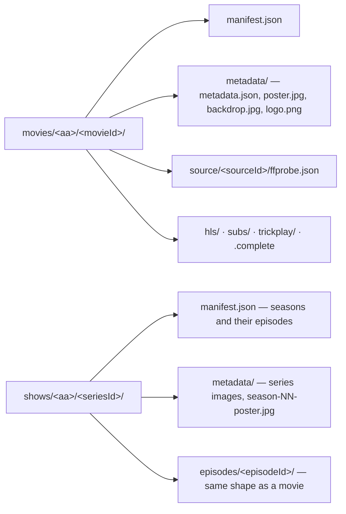

# schemas

Published contracts for the zaentrum platform, in two families:

- **Event payloads** — Avro schemas for Kafka events, the single source of
  truth for event shapes, published to a shared Apicurio schema registry.
- **Library storage** — JSON Schemas for the on-storage library (item
  `manifest.json` and `metadata/metadata.json`), served at
  <https://zaentrum.github.io/schemas/>. See [Library storage schemas](#library-storage-schemas).

## Status

The Avro schemas cover five event domains: library item lifecycle, transcode
processing, playback sessions, download-gateway adapters, and push-notification
fan-out. The library storage schemas are a draft; see their changelog below.

## Layout

```
stube/
  library/    item lifecycle events (created/updated/deleted)
  processing/ transcoder task + result events
  playback/   session lifecycle from chino-stream / tv-stream / musig-stream
  download/   download-gateway adapter completion events
  notify/     fan-out push notification requests
library/v1/
  manifest.schema.json, metadata.schema.json, defs.schema.json
  examples/                a movie and a series in the storage layout
tools/
  publish-to-apicurio.sh           publish Avro schemas to a registry
  validate-library.py              validate a library tree
  test-validate-library.py         broken trees the validator must reject
  library-migrate.py               reference migrator from a legacy catalog
  make-library-examples.py         regenerate library/v1/examples
```

The top-level `stube/` directory mirrors the Avro namespace and Kafka topic
prefix (`stube.<domain>`); it is an operational name and is kept as-is.

## Naming convention

- Topic: `stube.<domain>.<event>` (e.g. `stube.library.item.created`).
- Avro namespace: `stube.<domain>` (mirrors directory).
- Avro record name: `PascalCase` (`ItemCreated`, `TaskTranscode`).
- Artifact id in the registry: dot-joined path without extension
  (e.g. `stube.library.item-created`).

## Local development

Validate every schema parses as JSON:

```bash
find stube -name '*.avsc' -print0 | xargs -0 -I{} python -c "import json,sys; json.load(open('{}'))"
```

Or, if you have `avro-tools`:

```bash
find stube -name '*.avsc' -exec avro-tools compile schema {} /tmp/avro-gen \;
```

## Publishing

`tools/publish-to-apicurio.sh` walks every `.avsc` and publishes it to an
Apicurio registry. Point it at your own registry via environment variables:

```bash
APICURIO_URL=https://apicurio.example/ GROUP_ID=zaentrum ./tools/publish-to-apicurio.sh
```

## Library storage schemas

`library/` holds JSON Schemas (draft 2020-12) for the platform's on-storage
library, where storage is the source of truth and databases would be caches
built by reading it. The format is ahead of the code: no platform service reads
or writes it yet. Every item is a folder with two documents:

| Document | What it holds |
|---|---|
| `manifest.json` | The entry point. What the item is (type, primary title, reference ids), the playback fields a streaming service reads (unchanged from the version 2 package manifest), and for every version of a movie or episode what the original file contained and what the package carries and lost. |
| `metadata/metadata.json` | Every text (localised titles, overviews, credits, dates, series and season details) and the list of images, which sit in the same `metadata/` folder. A re-sync from the reference database would rewrite only this file. |

Layout on storage:



`<aa>` is the first two hex characters of the id. Folders are keyed only by
stable ids, never by titles or numbers, so a rename, renumbering or alternate
episode order never moves a file. A second version of a movie or episode
(a director's cut, a black-and-white presentation) is stored in
`versions/<versionId>/` inside the item folder with its own playback block.

Validate a tree (schemas plus the cross-file rules: ids match folders, images
match their hashes, a series lists exactly its episode folders):

```sh
pip install "jsonschema[format-nongpl]>=4.23" referencing
python tools/validate-library.py <root-with-movies-and-shows>
python tools/validate-library.py --check-media <root>    # also require every playback path to exist
python tools/test-validate-library.py                    # prove the validator rejects broken trees
```

`tools/library-migrate.py` is a reference migrator that builds item folders
from a legacy catalog export plus probe output. A value the export does not
hold stays empty rather than guessed, and where automation cannot decide it
records a `review` for a person. `tools/make-library-examples.py` regenerates
`library/v1/examples`.

### Library v1 changelog

v1 is a draft until a platform service adopts it. Every change is listed here;
rebuild a library with the current migrator after one.

- **2026-09-13 (d)** — audio and subtitle tracks record their `purpose`
  (subtitles: `dialogue`, `sdh`, `forced`, `signs-songs`, `commentary`, `lyrics`;
  audio: `main`, `commentary`, `description`) and `purposeFrom`; audio renditions
  gain `original` and `forcedSubtitle`, the forced track shown while subtitles
  are off; subtitle renditions gain `variant`; video streams record
  `closedCaptions`; essence gains SDH and forced subtitle languages, commentary
  subtitles, audio description tracks and closed captions; losses gain
  `closed-captions-dropped`.
- **2026-09-13 (c)** — `package.peakBandwidthBps` replaces `package.bitrateBps`
  (the value is a playlist peak, not an average); timestamps require an
  upper-case `T` and `Z`; `version` must be the integer 3; `probe.at` may be
  null; an episode listing path must be `episodes/<id>/`.
- **2026-09-13 (b)** — source `labels.medium` replaces `releaseSource`,
  `proper` and `revision`; version paths must be `.` or `versions/<id>/`;
  rendition languages follow the language rule; `packagedAt` is a timestamp;
  a series carries no playback fields; packages gain `sizeBytes`; metadata gains
  `videos[]`, season `tmdbSeason` and the `folder-name` origin.
- **2026-09-13 (a)** — `manifest.json` and `metadata/metadata.json` replace the
  four-document layout (`work`, `version`, `source`, `package`).

The format is documented in the
[zaentrum wiki](https://github.com/zaentrum/zaentrum/wiki/library).

## License

[MPL-2.0](LICENSE).
