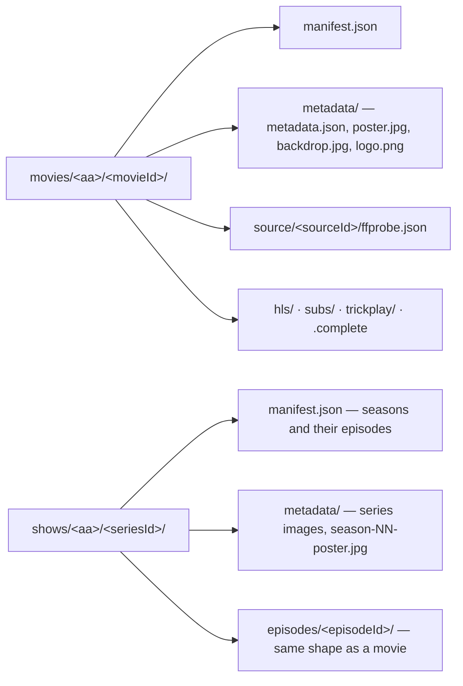

# schemas

Avro schemas for the zaentrum event-driven platform. This repo is the
single source of truth for Kafka event payload shapes across the platform,
published to a shared Apicurio schema registry.

## Status

First wave covers the five core domains: library item lifecycle, transcode
processing, playback sessions, download-gateway adapters, and push-notification
fan-out.

## Layout

```
stube/
  library/    item lifecycle events (created/updated/deleted)
  processing/ transcoder task + result events
  playback/   session lifecycle from chino-stream / tv-stream / musig-stream
  download/   download-gateway adapter completion events
  notify/     fan-out push notification requests
tools/
  publish-to-apicurio.sh   helper for publishing schemas to a registry
```

The top-level `stube/` directory mirrors the Avro namespace and Kafka topic
prefix (`stube.<domain>`); it is an operational name and is kept as-is.

## Naming convention

- Topic: `stube.<domain>.<event>` (e.g. `stube.library.item.created`).
- Avro namespace: `stube.<domain>` (mirrors directory).
- Avro record name: `PascalCase` (`ItemCreated`, `TaskTranscode`).
- Artifact id in the registry: dot-joined path without extension
  (e.g. `stube.library.item-created`).

## Local development

Validate every schema parses as JSON:

```bash
find stube -name '*.avsc' -print0 | xargs -0 -I{} python -c "import json,sys; json.load(open('{}'))"
```

Or, if you have `avro-tools`:

```bash
find stube -name '*.avsc' -exec avro-tools compile schema {} /tmp/avro-gen \;
```

## Publishing

`tools/publish-to-apicurio.sh` walks every `.avsc` and publishes it to an
Apicurio registry. Point it at your own registry via environment variables:

```bash
APICURIO_URL=https://apicurio.example/ GROUP_ID=zaentrum ./tools/publish-to-apicurio.sh
```

## License

[MPL-2.0](LICENSE).

## Library storage schemas

`library/` holds JSON Schemas (draft 2020-12) for the platform's on-storage
library, where storage is the source of truth and databases are caches built
by reading it. Every item is a folder with two documents:

| Document | What it holds |
|---|---|
| `manifest.json` | The entry point. What the item is (type, primary title, reference ids), the playback fields a streaming service reads (unchanged from the version 2 package manifest), and for every version of a movie or episode what the original file contained and what the package carries and lost. |
| `metadata/metadata.json` | Every text (localised titles, overviews, credits, dates, series and season details) and the list of images, which sit in the same `metadata/` folder. A re-sync from the reference database rewrites only this file. |

Layout on storage:



`<aa>` is the first two hex characters of the id. Folders are keyed only by
stable ids, never by titles or numbers, so a rename, renumbering or alternate
episode order never moves a file. A second version of a movie or episode
(a director's cut, a black-and-white presentation) is stored in
`versions/<versionId>/` inside the item folder with its own playback block.

Validate a tree (schemas plus the cross-file rules: ids match folders, images
match their hashes, a series lists exactly its episode folders):

```sh
pip install "jsonschema>=4.23" referencing
python tools/validate-library.py <root-with-movies-and-shows>
python tools/validate-library.py --check-media <root>    # also require every playback path to exist
```

`tools/library-migrate.py` is a reference migrator that builds item folders
from a legacy catalog export plus probe output. It never invents a value: a
field the source data does not hold is left empty and reported.
`tools/make-library-examples.py` regenerates `library/v1/examples`.

The format is documented in the
[zaentrum wiki](https://github.com/zaentrum/zaentrum/wiki/library).
