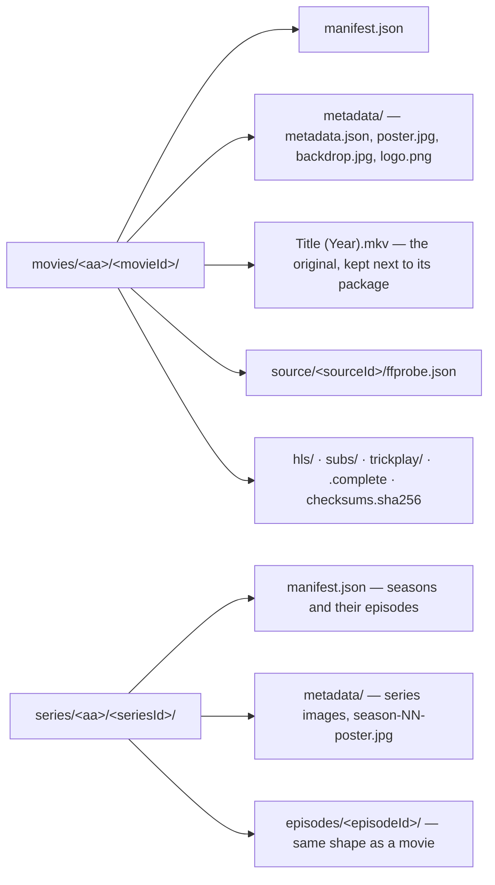
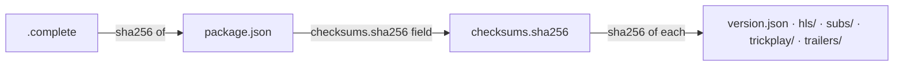

# schemas

Published contracts for the zaentrum platform, in two families:

- **Event payloads** — Avro schemas for Kafka events, the single source of
  truth for event shapes, published to a shared Apicurio schema registry.
- **Library storage** — JSON Schemas for the on-storage library, served at
  <https://zaentrum.github.io/schemas/>, in two versions: [v1](#library-storage-schemas), where
  storage is the source of truth and every item is a `manifest.json` plus a
  `metadata/metadata.json`, and [v2](#library-storage-schemas--v2), where the database is the
  working copy and the tree is a written-once record that can rebuild it.

## Status

The Avro schemas cover five event domains: library item lifecycle, transcode
processing, playback sessions, download-gateway adapters, and push-notification
fan-out. The library storage schemas are a draft; see their changelog below.

## Layout

```
stube/
  library/    item lifecycle events (created/updated/deleted)
  processing/ transcoder task + result events
  playback/   session lifecycle from chino-stream / tv-stream / musig-stream
  download/   download-gateway adapter completion events
  notify/     fan-out push notification requests
library/v1/
  manifest.schema.json, metadata.schema.json, defs.schema.json
  examples/                a movie and a series in the storage layout
library/v2/
  item.schema.json, metadata.schema.json, person.schema.json, source.schema.json,
  version.schema.json, package.schema.json, event.schema.json, extra.schema.json,
  defs.schema.json
  examples/                a movie, a series, a deletion, their extras and the people they credit
tools/
  publish-to-apicurio.sh           publish Avro schemas to a registry
  validate-library.py              validate a v1 library tree
  test-validate-library.py         broken v1 trees the validator must reject
  library-migrate.py               reference migrator from a legacy catalog
  make-library-examples.py         regenerate library/v1/examples
  package-checksums.py             write or verify each package's checksums on storage
  validate-library-v2.py           validate a v2 library tree
  test-validate-library-v2.py      broken v2 trees the validator must reject
  make-library-v2-examples.py      regenerate library/v2/examples
  library-v2-from-catalog.py       write v2 records for a catalog's items
  library-v2-from-v1.py            convert v1 item folders into v2 records
  library-v2-rebuild.py            the catalog contents a v2 tree implies
  library-v2-media-check.py        check a v2 tree against the bytes, without jsonschema
  library-v2-upgrade.py            upgrade a v2 tree in place to the layout in which every record proves itself
  library-v2-sweep.py              find provable garbage in a v2 tree and, through a quarantine, remove it
  libv2_records.py                 the record logic the packager vendors: source, version, package, extra records
  test-library-v2-tools.py         prove the v2 tools do what they say
  testdata/libv2_records/          probes and manifests, and the records libv2_records.py writes from them
```

The top-level `stube/` directory mirrors the Avro namespace and Kafka topic
prefix (`stube.<domain>`); it is an operational name and is kept as-is.

## Naming convention

- Topic: `stube.<domain>.<event>` (e.g. `stube.library.item.created`).
- Avro namespace: `stube.<domain>` (mirrors directory).
- Avro record name: `PascalCase` (`ItemCreated`, `TaskTranscode`).
- Artifact id in the registry: dot-joined path without extension
  (e.g. `stube.library.item-created`).

## Local development

Validate every schema parses as JSON:

```bash
find stube -name '*.avsc' -print0 | xargs -0 -I{} python -c "import json,sys; json.load(open('{}'))"
```

Or, if you have `avro-tools`:

```bash
find stube -name '*.avsc' -exec avro-tools compile schema {} /tmp/avro-gen \;
```

## Publishing

`tools/publish-to-apicurio.sh` walks every `.avsc` and publishes it to an
Apicurio registry. Point it at your own registry via environment variables:

```bash
APICURIO_URL=https://apicurio.example/ GROUP_ID=zaentrum ./tools/publish-to-apicurio.sh
```

## Library storage schemas

`library/` holds JSON Schemas (draft 2020-12) for the platform's on-storage
library, where storage is the source of truth and databases would be caches
built by reading it. The format is ahead of the code: no platform service reads
or writes it yet. Every item is a folder with two documents:

| Document | What it holds |
|---|---|
| `manifest.json` | The entry point. What the item is (type, primary title, reference ids), the playback fields a streaming service reads (unchanged from the version 2 package manifest), and for every version of a movie or episode what the original file contained and what the package carries and lost. |
| `metadata/metadata.json` | Every text (localised titles, overviews, credits, dates, series and season details) and the list of images, which sit in the same `metadata/` folder. A re-sync from the reference database would rewrite only this file. |

Layout on storage:


```mermaid
flowchart LR
  M["movies/&lt;aa&gt;/&lt;movieId&gt;/"] --> MM["manifest.json"]
  M --> MD["metadata/ — metadata.json, poster.jpg, backdrop.jpg, logo.png"]
  M --> MO["Title (Year).mkv — the original, kept next to its package"]
  M --> MS["source/&lt;sourceId&gt;/ffprobe.json"]
  M --> MP["hls/ · subs/ · trickplay/ · .complete · checksums.sha256"]
  S["series/&lt;aa&gt;/&lt;seriesId&gt;/"] --> SM["manifest.json — seasons and their episodes"]
  S --> SD["metadata/ — series images, season-NN-poster.jpg"]
  S --> E["episodes/&lt;episodeId&gt;/ — same shape as a movie"]
```

`<aa>` is the first two hex characters of the id. Folders are keyed only by
stable ids, never by titles or numbers, so a rename, renumbering or alternate
episode order never moves a file. A second version of a movie or episode
(a director's cut, a black-and-white presentation) is stored in
`versions/<versionId>/` inside the item folder with its own playback block.

Validate a tree (schemas plus the cross-file rules: ids match folders, images
match their hashes, a series lists exactly its episode folders):

```sh
pip install "jsonschema[format-nongpl]>=4.23" referencing
python tools/validate-library.py <root-with-movies-and-series>
python tools/validate-library.py --check-media <root>    # also require every playback path to exist
python tools/test-validate-library.py                    # prove the validator rejects broken trees
```

`tools/library-migrate.py` is a reference migrator that builds item folders
from a legacy catalog export plus probe output. A value the export does not
hold stays empty rather than guessed, and where automation cannot decide it
records a `review` for a person. `tools/make-library-examples.py` regenerates
`library/v1/examples`.

### Library v1 changelog

v1 is a draft until a platform service adopts it. Every change is listed here;
rebuild a library with the current migrator after one.

- **2026-09-14 (e)** — the series category folder is `series/`, matching `type:
  series` and `seriesId` (was `shows/`). No views and no links: the migrator's
  plan moves files into place and `--check-media` rejects hard links.
- **2026-09-14 (d)** — a version's folder is the one destination of its media:
  the source record's `file.path` names the original file placed next to the
  package (null while it is still only in the source library, and after
  deletion). The validator checks its size and qh1 with `--check-media`, and the
  migrator plans to link or move originals into their version folders.
- **2026-09-14 (c)** — `chapters`, `chaptersFrom` and `segments` (intro, recap,
  credits) move from the source record to the version; the package loses
  `chapters` and the `chapters-dropped` loss, since the version keeps the marks;
  packages gain `checksums` (a `checksums.sha256` file per version folder,
  computed on storage by `tools/package-checksums.py`). The validator checks
  trickplay sprite sheets against the VTT and package files against their
  checksums.
- **2026-09-14 (b)** — behaviour is not library data: `package.decisions`
  (default audio and subtitle), audio `forcedSubtitle` and source
  `subtitleDecisions` are removed. Players and per-user settings derive them from
  `purpose` and language. The version 2 `default`, `forced` and `visible` fields
  stay as playback hints for existing readers.
- **2026-09-14 (a)** — no schema change; the migrator reports package audio titles
  that claim more than the rendition carries, and interchangeable or
  indistinguishable audio renditions, for building track menus.
- **2026-09-13 (e)** — renditions require `purpose` and `purposeFrom`;
  `purposeFrom` gains `content` (a forced track recognised by its small number of
  events); subtitle streams record `events`; audio streams and renditions gain
  `variant`; stream `dispositions` hold only the file's own flags; a
  `forcedSubtitle` must be in its audio's language, and a forced track may not be
  flagged default.
- **2026-09-13 (d)** — audio and subtitle tracks record their `purpose`
  (subtitles: `dialogue`, `sdh`, `forced`, `signs-songs`, `commentary`, `lyrics`;
  audio: `main`, `commentary`, `description`) and `purposeFrom`; audio renditions
  gain `original` and `forcedSubtitle`, the forced track shown while subtitles
  are off; subtitle renditions gain `variant`; video streams record
  `closedCaptions`; essence gains SDH and forced subtitle languages, commentary
  subtitles, audio description tracks and closed captions; losses gain
  `closed-captions-dropped`.
- **2026-09-13 (c)** — `package.peakBandwidthBps` replaces `package.bitrateBps`
  (the value is a playlist peak, not an average); timestamps require an
  upper-case `T` and `Z`; `version` must be the integer 3; `probe.at` may be
  null; an episode listing path must be `episodes/<id>/`.
- **2026-09-13 (b)** — source `labels.medium` replaces `releaseSource`,
  `proper` and `revision`; version paths must be `.` or `versions/<id>/`;
  rendition languages follow the language rule; `packagedAt` is a timestamp;
  a series carries no playback fields; packages gain `sizeBytes`; metadata gains
  `videos[]`, season `tmdbSeason` and the `folder-name` origin.
- **2026-09-13 (a)** — `manifest.json` and `metadata/metadata.json` replace the
  four-document layout (`work`, `version`, `source`, `package`).

The format is documented in the
[zaentrum wiki](https://github.com/zaentrum/zaentrum/wiki/library).

## Library storage schemas — v2

v2 turns v1 around. The **database is the working copy**: services read and write it at runtime,
and nothing walks the tree to answer a request. **Storage is the record**: every item folder holds
the facts about itself as they were when they were made — its identity, each original that entered
it, each version and package produced from it, and the texts and images the database held — which
is enough to rebuild the database and nothing more. There is no crawler; the tree is read on two
occasions only, a deliberate rebuild and a deliberate verification.

That makes every file single-writer and one-directional, which is why there is no `manifest.json`
any more and no `rev`, `updatedAt` or `review` anywhere. A file is either a record of something
that cannot change — `item.json`, `sources/<id>/source.json`, `versions/<id>/version.json`,
`versions/<id>/package.json`, `events/<…>/event.json`, `extras/<id>/extra.json` — written once when
the thing it describes is made and never touched again, or a projection of the database
(`metadata.json`, and `person.json` for a person), replaced whole by the service that owns it. **A
fact about the bytes is a record; a decision the database holds is a projection**, so what an
original contained and what a package lost are written once, while which version plays by default,
what a viewer's version picker says, how far to trust the reference ids, how the episodes are
ordered and how the extras are shown live in `metadata.json` under `library`. Behaviour is neither:
which track a viewer gets — the player's rule, or a subtitle default a person chose — is the
database's alone, so a rebuild restores no such choice. Nothing is merged, so there is no conflict
to resolve. The few facts that arise later get their own folder under `events/` instead of a
rewrite: an original deleted, a version removed, a package superseded. Every version is a folder, so
a re-package is a new folder rather than an edit, and a record always sits next to the bytes it
describes.

```
movies/<aa>/<itemId>/
  item.json                        identity, written once
  checksums.sha256                 covers item.json, written with it
  metadata.json                    the database's texts, projected
  metadata/<sha256>.jpg            images named by their own content hash
  sources/<sourceId>/
    source.json                    one original as it was found, written once
    ffprobe.json                   the verbatim probe, and each copied sidecar beside it
    checksums.sha256               covers the files above, written with them
  versions/<versionId>/
    version.json                   edition, presentation, marks, sources — written once
    <original file>                the original, when this version keeps it
    hls/  subs/  trickplay/        the package
    checksums.sha256               version.json and every package file, sha256sum -c format
    package.json                   renditions, losses, and the hash of checksums.sha256
    .complete                      the hash of package.json: the version is finished
  events/<timestamp>-<eventId8>-<kind>/
    event.json                     a fact that arose later, written once
    checksums.sha256               covers event.json, written with it
  extras/<extraId>/
    extra.json                     a piece of bonus material, written once
    <original file>                the extra itself, when it is kept
    hls/  subs/  trickplay/        its package, when it has one
    checksums.sha256               extra.json and every file above, the original included
    package.json  .complete        as a version's, when it is packaged
series/<aa>/<seriesId>/            item.json, checksums.sha256, metadata.json, metadata/, extras/,
                                   episodes/<episodeId>/ (no extras/ in an episode)
people/<aa>/<personId>/
  person.json                      the database's person, projected
  <sha256>.jpg                     the portraits it lists, named by their own content hash
.work/                             beside the record, not part of it: what the platform keeps meanwhile
```

**On the platform, an original never enters the library.** It waits outside the record — among the
arrivals, `.work/incoming/` beside `movies/`, `series/` and `people/` at the share's root — until a
version made from it is packaged, verified and recorded, and is deleted then. So a version the
platform writes keeps no original (`originalFiles: []`) and its package is canonical from the start;
the source folder keeps what describes the original — its record, the verbatim probe, copies of the
sidecars that sat beside it — and an `original-deleted` event records the deletion, naming the source
(an original deleted outside the record) and what the package does not carry of it. An extra the
platform takes in keeps only its package, and `packagedFrom` says what it was made from. Every tool
reads past `.work/` and any other entry at the root whose name begins with a dot: the arrivals, the
workers' handoffs, the trash and a sweep's quarantine are not the record.

**People are a category of their own.** A credit names a person by `personId`, and people are
shared by every item that credits them, so a person's biography, dates, the department they are
known for, reference ids and portraits live once, in `people/<aa>/<personId>/person.json` beside
`movies/` and `series/`, with the same id-based folder and shard. Like `metadata.json` it is a
projection, replaced whole by the one service that owns people, so a rebuild restores every person
as the last projection left them. It lists no credits — those are the items' own, by `personId` —
and a credit whose person has no folder yet is a note, not an error: the person may simply not have
been projected. A credit's `name` is the name as recorded for that title, which may be the one the
person went by then; the person's current name lives in `person.json`, and a reader prefers it
whenever the person has a record.

**A credit says what the person did.** Each credit is one person in one role. `role` is a token of
an open vocabulary, `^[a-z][a-z0-9-]{0,39}$`, whose well-known roles, in the order a reader lists
them, are `actor`, `creator`, `director`, `writer`, `producer`, `composer`, `cinematographer` and
`editor`; any other token is valid too, and a reader shows a role it does not know generically, under
the token, after the ones it knows. `job` is what the person did in the source's own words —
`Screenplay`, `Original Music Composer` — several jobs of one person in one role joined with `", "`;
`character` is whom an actor plays, a series' characters joined with `" / "`; `order` is the billing
order within the role; and `episodeCount` is how many of a series' episodes credit the person in that
role. Each is null where the source says nothing.

**A projection says how fresh it is.** The database refreshes from the reference source first and
rewrites a projection after, and a person changes more than a title does — a new role, a death, a
new photo — so a verification has to tell a projection that went stale from one that is current.
Both projections carry, from the same definitions in `defs`, `databaseUpdatedAt` — the modification
time of the database row the projection reflects, the row's own `modifiedAt` on the database's clock,
where `asOf` says when the projection was written — and `sources`, per reference source (`tmdb` for
now), when the database last fetched the entity from it (`fetchedAt`) and the day the source last
reported a change to it (`changedAt`). A projection whose row was modified since is stale, and is
fixed by projecting again, never by editing the file. Each image says whether it is the `primary`
one of its kind — at most one of a kind in a projection, in a series one per kind for the series and
one for each season — and where its bytes came from, in an `origin` of `source` (`tmdb`, `manual`,
`file`, `legacy-catalog`), `ref` (the source's own name for it, such as TMDB's file path) and
`fetchedAt`, so a refresh can tell the source replacing a photo from a person picking another, which
it leaves as it is. A projection written before names the origin's source alone, as a string; that
stays valid, a reader takes it as `{source: <it>}`, and the next projection writes the object.

**Bonus material lives beside its movie or series.** A featurette, a making-of, a deleted scene or a
trailer that is a file of its own is never an item: it sits in `extras/<extraId>/` inside the
folder of the movie or series it belongs to — never an episode's; a series' extra may name the
season it belongs to, which must be one the series' `metadata.json` lists. `extra.json` records
what it is — `kind` (`featurette`, `behind-the-scenes`, `making-of`, `deleted-scene`, `interview`,
`trailer`, `teaser`, `gag-reel`, `short`, `other`), the `title` it came with and `localizedTitles`,
`language`, `runtimeMs`, `seasonNumber`, the `originalFiles` kept in its folder and, in `originals`,
each one's size and fixity (`qh1`, and the `sha256` when known) the way a source record describes
its file, and, when the original was probed, the `container`, `streams`, `fidelity` and `essence` a
source record carries, with the `probe` that found them. An `origin` says where the file came from
when that can be named: `kind: link` with the `site`, `externalId`, `url` and `fetchedAt` of a video
published online that was downloaded. The folder is written once, like a version's: the original
and/or a package (`hls/ subs/ trickplay/` and a `package.json` that is the same record a version's
package is), with a `checksums.sha256` over `extra.json` and every file beside it; an extra is
retired by an `extra-removed` event, as a version is by `version-removed`. How a viewer sees the
extras is a decision, so it is projected: `metadata.json`'s `library.extras` holds, per extraId, the
`order`, a `hidden` flag and a `label` instead of the title; an extra nobody decided anything about
is shown after the ordered ones, in the order the extras were taken in. `metadata.json`'s `videos[]`
stays the place for videos published online, by reference, and a package's `trailers` stay the
playback layout v1 had; a trailer that exists as a local file of its own is an extra of kind
`trailer`, whose `origin` names its link.

| Schema | Document | `schema` field |
|---|---|---|
| [`item.schema.json`](https://zaentrum.github.io/schemas/library/v2/item.schema.json) | `item.json` | `zaentrum.library.item/2` |
| [`metadata.schema.json`](https://zaentrum.github.io/schemas/library/v2/metadata.schema.json) | `metadata.json` | `zaentrum.library.metadata/2` |
| [`person.schema.json`](https://zaentrum.github.io/schemas/library/v2/person.schema.json) | `people/<aa>/<personId>/person.json` | `zaentrum.library.person/2` |
| [`source.schema.json`](https://zaentrum.github.io/schemas/library/v2/source.schema.json) | `sources/<sourceId>/source.json` | `zaentrum.library.source/2` |
| [`version.schema.json`](https://zaentrum.github.io/schemas/library/v2/version.schema.json) | `versions/<versionId>/version.json` | `zaentrum.library.version/2` |
| [`package.schema.json`](https://zaentrum.github.io/schemas/library/v2/package.schema.json) | `versions/<versionId>/package.json`, `extras/<extraId>/package.json` | `zaentrum.library.package/2` |
| [`event.schema.json`](https://zaentrum.github.io/schemas/library/v2/event.schema.json) | `events/<timestamp>-<eventId8>-<kind>/event.json` | `zaentrum.library.event/2` |
| [`extra.schema.json`](https://zaentrum.github.io/schemas/library/v2/extra.schema.json) | `extras/<extraId>/extra.json` | `zaentrum.library.extra/2` |
| [`defs.schema.json`](https://zaentrum.github.io/schemas/library/v2/defs.schema.json) | shared definitions | — |

### A record proves itself

The records a rebuild trusts are covered by checksums written with them, in the folder they sit in,
so `sha256sum -c checksums.sha256` in any folder written once proves its records are the bytes that
were written — with no database and no network:

| Folder | Its `checksums.sha256` lists | Written |
|---|---|---|
| `movies/<aa>/<itemId>/`, `series/…`, `episodes/<id>/` | exactly `item.json` | with `item.json`, once |
| `sources/<sourceId>/` | exactly `source.json`, the probe and the sidecars | with them, once |
| `events/<…>/` | exactly `event.json` | with it, once |
| `versions/<versionId>/` | `version.json` and every package file | by the packager, when the package completes |
| `extras/<extraId>/` | `extra.json`, the originals and every package file | after every file it lists, once; when packaged, before `package.json` and `.complete` |

A version is the one folder written in two steps: the analyzer writes `version.json`, and the
packager closes the chain when the package completes — the checksums over `version.json` and every
package file, then `package.json` with the hash of the checksums file, then `.complete` holding
`sha256:<hex>` of `package.json`, and nothing else. One hash then proves the whole version:


```mermaid
flowchart LR
  DONE[".complete"] -->|"sha256 of"| PKG["package.json"]
  PKG -->|"checksums.sha256 field"| SUMS["checksums.sha256"]
  SUMS -->|"sha256 of each"| FILES["version.json · hls/ · subs/ · trickplay/ · trailers/"]
```

The checksums file therefore never lists `.complete`, `package.json` or itself — each holds the hash
of the link below it — and it never lists the originals, which their source records' fixity covers
and which may be deleted later. A version that has no package yet has no checksums file, and its
`version.json` is covered from the moment its package completes. **Projections are not covered, on
purpose**: `metadata.json` and `person.json` are replaced whole, so a checksum written with one would
be wrong after the next, and every image is named by the hash of its own bytes, so its name is its
check.

An extra is written whole, in one step, and keeps its original for as long as it exists — no event
deletes part of one — so its checksums list the originals too, unlike a version's. A packaged extra
closes the same chain a version does, `.complete` → `package.json` → `checksums.sha256` →
`extra.json`, the originals and every package file, and the checksums never list the two links
above them. Whether an extra is finished is told by its folder alone:

| The folder holds | It is |
|---|---|
| `.complete`, naming its `package.json` | finished, packaged |
| `checksums.sha256`, and no `package.json`, no `.complete`, no `hls/ subs/ trickplay/` | finished, the original only: the checksums file is written last, after the record and the originals, so it is the completion signal |
| `hls/ subs/ trickplay/` but no `.complete` | a package that never finished, which the sweep collects |
| no `checksums.sha256` and no package | an extra whose writer has not finished it: neither the database nor a rebuild uses it, and the sweep leaves it to the writer |

Because the checksums are written once, an extra kept only as its original is never packaged in
place. **Packaging it later is a new extra folder and an `extra-removed` event for the old one**:
every reader ignores the old folder from then on, and the sweep collects it once the removal is
older than its grace period. The example movie's trailer came to have its package that way.

### Applying events

The records describe things that cannot change, so a reader — a rebuild, a verify, a player's
catalog — reads an item's records first and then applies its `events/` in order of `at`, earliest
first. Five kinds, and what each one changes:

| Kind | Effect |
|---|---|
| `original-deleted` | The originals it names are gone from the version folder: the source it names, or all of them when it names none. Once none is left, that version's package is the only copy of it — canonical, whatever `role` its record was written with — and everything the package failed to carry is permanent. For a version that never kept the original in its folder — every version the platform writes — the original was deleted outside the record, and the event always names its source. |
| `version-removed` | The version is no longer part of the item. Ignore its folder even when it is still on storage: its package is not playable, and nothing but the item's events may point at it. The events that name it — the deletion of its original, the supersession of its package — are its history and stay as they were once its folder is gone, naming it by its `versionId`, or its package by the `packageId` an event of the item names beside it: this event is the record of where it went. One among another item's events removes nothing. |
| `package-superseded` | The package it names is no longer the one to use; the package under `supersededBy` is authoritative for its version from that moment. The superseded folder stays exactly as it was. |
| `extra-removed` | The extra its `extraId` names is no longer part of the item. Ignore its folder even when it is still on storage: it is not listed, not played, and nothing may point at it. The sweep collects a folder still there. |
| `note` | Nothing. It is something a person recorded that no other record holds; it may name an extra by its `extraId`. |

The **deletion gate** — what deleting a version's originals would cost — is not recorded anywhere.
A reader computes it as the essence of the version's sources minus the essence of its package, so it
stays right however often the version is re-packaged, and a version with an original and nothing
packaged can still answer it. The only fact is a person's answer: `accepted` on an `original-deleted`
event, named in essence terms (`surround`, `maxAudioChannels`, `subtitleLanguages:en`). It is a
subset of the gate and not necessarily all of it, because someone who measures again before deleting
may accept less.

Validate a tree (the schemas plus the rules that span files: ids match their folders, no media
outside a version or extra folder, every write-once folder's checksums cover exactly its records and
each version's chain holds, `package.json` exists exactly when `.complete` does, images are named by
their own hash, events reference records that exist — or a version a `version-removed` event of the
same item removed, and its package — and a deletion accepts no more than the gate its records
compute, episodes do not contradict their own numbering, a person folder holds its record and the
images it lists, at most one image of a kind is primary — in a series one per kind and season —
extras sit under a movie or a series and never an episode, an extra's checksums
list `extra.json` and every file beside it and its `originals` describe exactly its `originalFiles`
— with `--check-media` at the size and `qh1` they record — its package carries no trailers, only a
series' extra names a season and only one the series lists, `library.extras` names extras that are
there, and the folder of an extra an `extra-removed` event retired is ignored, gone or not; a 5.1
companion says what its track is for, an audio rendition is in a group the HLS layout names and a
subtitle made from a sidecar names one its version's source keeps; `packagedFrom` is only on a
packaged extra that keeps no original; a deletion of an original a version never kept names its
source; a source record without its file's fixity says why, and no version keeps such an original;
the projection's reference ids are of its type; `.work/` and every dot-entry at the root are not
looked at, and the folders of the store before the library — `media/`, `packages/`, `extras/`,
`incoming/` — are a note until the migration's cleanup moves them aside):

```sh
pip install "jsonschema[format-nongpl]>=4.23" referencing
python tools/validate-library-v2.py <root-with-movies-and-series>
python tools/validate-library-v2.py --check-media <root>      # also the bytes the records name
python tools/validate-library-v2.py --check-checksums <root>  # also hash every package file
python tools/test-validate-library-v2.py                      # prove it rejects broken trees
python tools/make-library-v2-examples.py                      # regenerate library/v2/examples
```

### Writing and reading a tree

These tools put the record on storage, read it back and keep it. They are plain standard-library
Python 3.11 and need no network, so they run where the share is mounted — piped into a pod if that
is the only place it is reachable (`oc exec -i deploy/packager -- python3 - <args> < tool.py`). The
database export they read is produced on the client side, so nothing needs a driver or a credential.
`library-v2-from-catalog.py` writes its source, version, package and extra records with
`libv2_records.py`, the module the packager vendors byte for byte so that both write the same
records; it finds the module beside it, and is piped behind it:
`cat tools/libv2_records.py tools/library-v2-from-catalog.py | oc exec -i deploy/packager -- python3 - <args>`.

```sh
# a catalog's rows, its package store and its originals become item folders, and its people folders
python tools/library-v2-from-catalog.py --export catalog.json --packages /…/packages \
       --media /…/media --out /…/library [--items id,id] [--media-mode copy|move|none] [--dry-run]

# only the people, into a tree written earlier: no item record is touched
python tools/library-v2-from-catalog.py --export catalog.json --out /…/library --people-only [--dry-run]

# only the projections of what the tree holds, after the database changed: no record is touched
python tools/library-v2-from-catalog.py --export catalog.json --out /…/library --projections-only [--dry-run]

# the platform's library staged from the store before it, for katalog-manager to adopt: nothing else is written
python tools/library-v2-from-catalog.py --platform --export catalog.json --root /var/lib/katalog --run 2026-10-07a \
       [--shard aa] [--dry-run]

# v1 item folders (manifest.json + metadata/) become v2 records, in place or into a new tree
python tools/library-v2-from-v1.py --in /…/library --in-place [--dry-run]

# the catalog contents a tree implies, with its events applied, and both directions against an export
python tools/library-v2-rebuild.py /…/library --out rows.json [--compare catalog.json [--subset] [--arrivals-root /…/.work]]

# the checks that must run where the files are: they need no jsonschema
python tools/library-v2-media-check.py /…/library [--checksums]

# a tree written before 2026-10-02 (b), brought to the layout in which every record proves itself
python tools/library-v2-upgrade.py /…/library [--dry-run] [--verbose]

# what a writer left behind that the records prove is garbage: listed, and with --apply removed
python tools/library-v2-sweep.py /…/library [--export catalog.json] [--grace 24h] [--apply] [--quarantine DIR] [--verbose]

python tools/test-library-v2-tools.py   # prove every one of them does what it says
```

`library-v2-upgrade.py` moves each `sources/<id>.json` and `events/<…>.json` into a folder of its own,
writes every write-once folder's checksums, and closes each finished version's chain; it changes no
record's content, reads no media — a package file's digest is carried forward from the checksums the
packager wrote, so a file that changed since stays caught — and leaves anything that contradicts its
records exactly as it was, as a conflict it reports. A run stopped anywhere is finished by the next,
and a second run changes nothing. It writes no `people/`: `library-v2-from-catalog.py --people-only`
adds those to an upgraded tree. It leaves every `extras/` folder as it is: there is nothing to
migrate, because an extra was only ever written in the layout in which it proves itself.

The catalog export carries, beside its items, a top-level `people` list, and
`library-v2-from-catalog.py` maps every field of it into `person.json`, `--people-only` included:

```json
{ "people": [ { "id": "…", "name": "…", "sortName": "…", "alsoKnownAs": ["…"],
                "birthDate": "…", "deathDate": "…", "birthPlace": "…", "biography": { "<lang>": "…" },
                "externalIds": { "tmdbPerson": "…", "imdb": "nm…" }, "knownForDepartment": "…",
                "metadataLocked": false, "lockedFields": ["…"], "fieldOrigins": { "<field>": "tmdb" },
                "tmdbFetchedAt": "…", "tmdbChangedAt": "…", "modifiedAt": "…",
                "artwork": [ { "kind": "profile", "contentType": "…", "base64": "…", "sha256": "…",
                               "width": 0, "height": 0, "isPrimary": true, "sourcePath": "/….jpg",
                               "fetchedAt": "…" } ] } ] }
```

`modifiedAt` becomes `databaseUpdatedAt`, `tmdbFetchedAt` and `tmdbChangedAt` become `sources.tmdb`
(only with a `tmdbFetchedAt`: a source entry says when it was fetched), `lockedFields` joins
`metadataLocked` in `curation`, and `fieldOrigins` is the database's own record, in place of the
catalog's. Each portrait is named by its own content, whose bytes decide its type and size whatever
the row says; it is `primary` where `isPrimary` says so — at most one, the first the export lists —
and its `origin` is TMDB with the `sourcePath` it was fetched from, or the catalog when the row names
no path. An item's images are mapped the same way. An item row's `modifiedAt`
becomes its `metadata.json`'s `databaseUpdatedAt`, and `sources.tmdb` is written when the row carries
`tmdbFetchedAt`, which items do not yet. A person the list holds by id and name alone — or whom only
a credit names, in a catalog without the list — is a valid record with nothing else in it, and what
the export does not carry, or holds wrongly, is left out with a note rather than guessed.

An item row's `people` are its credits, and become the credits of its `metadata.json`:

```json
{ "people": [ { "personId": "…", "name": "…", "role": "writer", "job": "Story, Teleplay",
                "character": null, "order": 0, "episodeCount": 3 } ] }
```

Each field is null where the catalog does not know it, and an export from before credits were
general, whose entries carry only `personId`, `name` and `role`, works as it is: the other fields
stay null. The export lists an item's credits in no particular order, so `library-v2-from-catalog.py`
writes them in the order a reader shows them — by role, the well-known ones in their order and any
other after them alphabetically, then by `order`, a credit without one last, then by name and
`personId` — and the same credits always make the same file. A credit whose role is not a token is
left out with a note, and so is an `order` or an `episodeCount` that is not a whole number, or a
count below nothing.

**`--projections-only` projects a tree again** after the database changed, which is what a stale
projection asks for. It rewrites the projections of what the tree already holds and nothing else:
every item's `metadata.json` and the images it lists in `metadata/`, every person's `person.json`
and their portraits, each replaced whole from the export through a temporary file and a rename. It
never writes, rewrites or touches a record written once — `item.json`, a source, a version, a
package, an extra, an event, any `checksums.sha256` — and an item or a person the export holds and
the tree does not is skipped with a note: creating one stays the full build's job, or
`--people-only`'s. An image is written once, under the name of its content, so one already there is
left as it is, and one a new projection no longer lists is left for the sweep, past its grace, where
the full build and `--people-only` remove it at once. What it writes is what the full build writes
from the same export, byte for byte; the one decision the build takes from the versions it creates —
which plays when the viewer does not choose — stays the one the projection on storage names while
that version is there, and is otherwise derived from the export's packaged assets as the build
derives it, with or without `--packages`.

A rebuilt catalog is only as complete as the record: the tree holds no per-user state, of a row's
modification times only the one its projection reflects, the paths it hands back are the version
folders the bytes moved into, and what a source record could not be told (an original that is
already gone, a file nothing probed) stays empty rather than guessed.

Bonus material becomes rows of its own, under `extras` in the rows JSON: what `extra.json` records,
the `order`, `hidden` and `label` the projection decided, and its original and package as playback
rows, in the order a viewer sees them; an extra that never finished is left out with a note. The
catalog keeps extras since katalog-manager's migration 039 (`com_nalet_katalog_itemextras`), but
`--compare` doesn't read that table yet, so these rows exist in the JSON only and `--compare` counts
them without comparing them. `library-v2-from-catalog.py` writes a trailer the catalog downloaded — a link
whose `localPath` is a file on the share — as an extra of kind `trailer` beside its movie or series,
copied or moved in as `--media-mode` says, keeps the link in `videos[]` and names it in the extra's
`origin`; an episode's stays a link, and so does every trailer with `--media-mode none`. The rebuild
gives a link of `videos[]` the original an extra with that origin keeps as its `localPath`, and
`--compare` compares a trailer's `localPath` by its file name — the file moved into its extra's
folder and kept its name, the reason `path` is not compared at all — so a migrated tree agrees with
the export it came from, downloaded trailers included. A removed extra has no row.

### Staging the platform's library

`library-v2-from-catalog.py --platform` stages the library of a platform from the store it kept
before — originals under `media/`, packages under `packages/`, extras under `extras/`, all at the
share's root — for katalog-manager to adopt. It reads that store and writes nothing outside
`.work/migration/<run>/`: the package files are hashed where they are and the originals probed where
they are, and the only files written are records, the images the database holds and copies of the
sidecars. Every item gets `staged/<itemId>/item/`, the folder as the library will hold it — its
version folders carry `version.json`, `checksums.sha256`, `package.json` and `.complete`, the
checksums listing the package files where the adopt puts them — and `units/<itemId>.json`, the plan of
what the adopt moves where and what it changes in the database; the people the items credit are
staged under `staged-people/`, and `report.json` says what is ready, every problem by its class, and
what deleting every original would cost. A plan's moves are renames, in order — the package folders
into the staged records, the item folder into place, the original and its sidecars to the arrivals,
what is left of an old package folder aside — and its guards are the old package's `manifest.json`
hash, its `.complete` time and a listing of the package folders, checked again before the first move.
The tool's docstring is the plan's reference.

The records are the platform's: a version keeps no original, and an original that was gone before the
library recorded it has a source record without fixity whose `probe.note` says so. Extras are the
catalog's own rows, named by their ids; ids are UUIDv5 of the item and a stable name, so staging
again writes the same records, and an item the library already holds is not staged again. `--dry-run`
writes only `report.json` and hashes nothing; `--shard aa` stages the items whose folder is in one
shard, from an export of that shard.

Once adopted, the library is verified where it is: `validate-library-v2.py --check-media` and the
media check on the share's root — `.work/` beside the record is not looked at — and
`library-v2-rebuild.py --compare` of a fresh export with `--arrivals-root <root>/.work`: the rows of
files waiting at the arrivals, and of an original retired since, are no part of the record, and a
subtitle the package made from a sidecar has no row of its own until its original is deleted — the
catalog's row of the sidecar stands for it. A subtitle row's `isDefault` is never compared: the adopt
keeps a default a person chose, and no record holds one.

### Telling an orphan from a loss

Deleting an item deletes its folder — that is the writer's obligation, and a writer that misses it
leaves a record the database does not know. Seen from the tree alone, such a folder could be an item
the database **deleted** (remove the folder) or one it **lost** (restore it), and only the database
can say which. So the catalog export carries the database's deletion log, beside its rows:

```json
{ "exportedAt": "…", "items": [ … ],
  "deletedItems": [ { "id": "<itemId>", "type": "movie", "deletedAt": "<RFC 3339>", "deletedBy": "<who>" },
                    { "id": "<personId>", "type": "person", "deletedAt": "<RFC 3339>", "deletedBy": "<who>" } ] }
```

An entry's `type` says what it deleted: an item, by its own type (`movie`, `series`, `episode`), or
a person — the catalog deletes a person no title credits any more and logs them as one. An entry
without a type is an item's, as every entry of an export from before people were logged is, and an
entry of a type the format does not know proves nothing.

`library-v2-rebuild.py --compare` sorts every item that exists on one side only into one of three
classes, each listed with its ids:

| Class | What it means | Fails the compare |
|---|---|---|
| orphan | On storage, not in the database, in the deletion log, and nothing in its folder is newer than that deletion: the database deleted it, and the folder is safe to remove. An episode whose series was deleted is an orphan with it. | no |
| lost | On storage and not in the database, but not in the log either — or in the log while a record in the folder is newer than the deletion, because the id was created again since: the database lost what the record still knows, a restore candidate. | yes |
| missing record | In the database, not on storage: the tree cannot restore it. Not counted with `--subset`. | yes |

*Nothing newer* is the newest moment any record in the folder states — `item.json`'s `createdAt` and
`migratedAt`, `metadata.json`'s `asOf`, its `databaseUpdatedAt` (on the database's clock, the one
`deletedAt` is on) and its TMDB `fetchedAt`, every source's `takenAt`, version's and package's
`createdAt`, event's `at` and extra's `createdAt`, and for a series its episodes' as well — and a
record that states none counts with its file's modification time, so a folder never looks older than
what is in it. An id that is in the log and in the database is present: the item that exists wins,
and the log entry describes an earlier life. When `deletedItems` is `null` — a catalog that keeps no
log yet — or absent, nothing can be called deleted, and every item only on storage is lost. `[]` is
a log that says nothing was deleted. A field that disagrees between two rows both sides hold fails
the compare too.

People are compared as well. The database's people are the export's top-level `people` list when it
carries one, and otherwise everyone its items credit — a `personId` and a name, which is all a catalog
without person records knows — and only the fields the export carries are compared: every field of
the people list, and each portrait by its bytes, kind, type, size, dimensions, primary flag, TMDB
path and fetch time. A person only on storage is an **orphan** when the deletion log names them as a
person and nothing in their folder is newer than that deletion — `person.json`'s `asOf`, its
`databaseUpdatedAt` and TMDB `fetchedAt`, each image's `fetchedAt`, and the modification time of a
file that states none — like an item's, not a failure. An item record on storage that still credits
them is a note: that projection is stale, and the sweep keeps the person's folder until no item
record credits them. Any other person only on storage is *lost* when an item on storage that is
lost, or that the database holds, credits them, and *unreferenced* — listed, kept, not a failure,
never swept — when nothing the database holds credits them; so is a person an untyped entry of an
older export names, which is an item's. A person the database holds is present, whatever the log
says.

### Telling a stale projection from a current one

A projection says which state of its database row it reflects, so `--compare` judges every item and
every person both sides hold by it: the projection's `databaseUpdatedAt` against the export's
`modifiedAt` for that row, to the second, the precision an export prints.

| Class | What it means | Fails the compare |
|---|---|---|
| stale projection | The row was modified after the state its projection reflects: the database changed since. It is fixed by projecting again — `library-v2-from-catalog.py --projections-only` does, for items and people, and touches no record — never by editing the file. | yes |
| projection ahead of the database | The projection reflects a later state of the row than the export holds: an export older than the tree, or a database restored from before it. | yes |

The field differences of a stale projection are listed as well, marked as its, so a verification can
tell the rows that only need projecting again from the current ones that really disagree. A
projection that does not say which state it reflects — one written before 2026-10-02 (f) — is
counted as of unknown freshness and fails nothing, a row the export gives no `modifiedAt` is not
judged, and `--ignore-fields modifiedAt` judges none. The fields that came with freshness — an item
row's `tmdbFetchedAt` and `tmdbChangedAt`, an image row's dimensions, primary flag and TMDB path — are
compared where the export carries them, so an export from before them makes no tree that has them
differ.

A credit is matched by its person and role, so a credited name or a job that changed is that credit
changed, never one credit lost and another gained, and two namesakes in one role stay two credits.
Its `job`, `character`, `order` and `episodeCount` are compared as those fields are: where the export
carries them, so an export from before credits were general makes no tree differ. A tree from before
them is compared, against an export that has them, in every field the export carries, as a field a
tree lacks always is: it cannot give back what it does not hold, so each difference reads
`storage None` — or names a credit storage has nothing of — the database knowing more, and the
compare fails until `--projections-only` projects the tree again. A value the database does not know
either is no difference.

### Sweeping what a writer missed

Nothing walks the tree on its own, so garbage a writer leaves stays until someone collects it.
`library-v2-sweep.py` finds what the records and the database prove is garbage, lists it with the
reason, and with `--apply` removes it:

| What | Proved by |
|---|---|
| a deleted item's folder | the export's deletion log names the id as an item's, the database does not hold it again, no record in the folder — episodes included — is newer than the deletion, and the deletion is older than the grace |
| a deleted person's folder | the export's deletion log names the id as a person's (`type: person`), the database does not hold them again — not in its people list, not credited by any of its items — nothing in the folder is newer than the deletion, the deletion is older than the grace, and no item record on storage still credits them: one that does keeps the folder until it is projected again (`--projections-only`), unless the same sweep removes that item's folder as a deleted item. It is checked last in the quarantine, against the credits on storage once every other target is settled |
| an unfinished version | no `.complete`, and either no `version.json` (nothing can have known it), or no original kept and nothing names it — not `metadata.json`, not an event other than its removal, not the export; a version that keeps an original loses only the unfinished package beside it |
| an extra's unfinished package | package files (`hls/ subs/ trickplay/`, `package.json`) and no `.complete`, and then the same proof as a version's: the whole folder without `extra.json`, or with no original kept and nothing naming it — not `library.extras`, not another event, not the export — and beside a kept original only the package and the checksums over it. An extra that holds no package is never swept: it is finished by its checksums, or its writer's to finish |
| a removed version's folder | a `version-removed` event names it and is older than the grace, and nothing names the version but its history — not `metadata.json`, not the export: the whole folder, whatever it holds. The catalog deletes it itself after the grace a superseded version keeps; this collects one that delete missed |
| a removed extra's folder | an `extra-removed` event names it and is older than the grace, and nothing else names the extra — not `library.extras`, not another event, not the export: the whole folder, whatever it holds |
| a dropped image | named by the hash of its own bytes, in an item's `metadata/` or beside a `person.json`, and not listed by a projection that is itself older than the grace |

Everything must be older than the grace period (`--grace 24h` by default), because a write in flight
looks exactly like garbage: a record is written before its database row, and an image before the
projection that lists it. It never touches anything referenced, anything younger than the grace,
anything it cannot classify, or a person's folder the deletion log does not name as a person's, and
it lists what it left alone and why. Without `--export`, or with a `deletedItems` that is `null`, no
item or person folder is swept at all, and with a log none of whose entries carries a type — an
export from before people were logged — no person's.

`--apply` renames every target into a quarantine in the work tree, `.work/quarantine/<YYYYMMDDTHHMMSSZ>/`
(`--quarantine` names another folder on the same share), with a `sweep.json` that says where each came
from — a rename on the same filesystem, never a copy. It then reads the export, the projections and
the events again, puts back anything referenced by then, and only after that deletes the quarantine. A
quarantine an interrupted `--apply` left behind is finished by the next one — and so is one a sweep
from before 2026-10-06 left in `_swept/` at the library root, which the validator names until then. A file the validator would otherwise
call unlisted — an image a projection dropped — is a note for the sweep, not an error, and so is a
package that never finished, a version's or an extra's, and an extra its writer has not finished.

### Library v2 changelog

v2 is a draft until a platform service adopts it. v1 stays published and unchanged; nothing
migrates automatically. Every change is listed here; regenerate the examples after one.

- **2026-10-06 (c)** — a subtitle's default is the database's. Which subtitle a viewer gets is
  behaviour: the player's rule, or a default a person chose, which the database keeps for the rows
  it holds — the platform's adopt carries it over. No record holds it; a package's `default` is only
  what its playlist says. `library-v2-rebuild.py` now writes every subtitle row with `isDefault`
  false, so a database rebuilt from the tree has lost the defaults people chose, and `--compare`
  never compares a subtitle row's `isDefault`, whatever `--ignore-fields` says. No record changes.
- **2026-10-06 (b)** — a removed version keeps its history. The validator rejected the tree a
  version's removal leaves: once a `version-removed` event retired a version and its folder was
  deleted, the events that had named it — the supersession of its package, the deletion of its
  original — were reported as naming no version and no package. They are the version's history, so
  they stay valid: an event may name a version a `version-removed` event of the same item removed, by
  its `versionId`, and its package by the `packageId` an event of the item names beside it, as its
  subject or as its successor. A removal among another item's events removes nothing, and a version
  that was never there is still an error. `event.schema.json` says so where it says how events apply;
  every tree that validated before still does.
- **2026-10-06 (a)** — the platform writes the library. The format described a library its tools
  write; the platform's own writers — the packager, the catalog's projector and retire job — keep no
  original in the library: an original waits outside the record until its package is recorded, and
  is deleted then. Every change is additive, so every tree written before validates as it is.
  `package.json` gains what the packager's playlist says: `renditions.audioSurround` (5.1 companions
  in an audio group of their own), a rendition's `group` and `name`, a video rendition's
  `peakBitrateBps`, `videoRange`, `label` and `encoder`, a subtitle's `name`, `hls` and
  `fromSidecar` (the copy of the sidecar it was made from, which its source folder keeps), and `hls`,
  the HLS layout. `extra.json` gains `packagedFrom`, the original a package-only extra was made from.
  `metadata.json` gains `externalIds`, the reference ids the item has now, which `item.json` cannot
  follow; the rebuild prefers them. An `original-deleted` event for a version that never kept its
  original names the source whose original was deleted outside the record. A source record may lack
  its file's fixity when `probe.note` says why: an original that was gone before the library recorded
  it. The validator holds each of these to its rule, and reads past `.work/` and every dot-entry at
  the library root. `libv2_records.py` is new: the record logic the packager vendors byte for byte —
  stream, essence, losses, the deletion gate, and builders for every record a package run writes —
  which `library-v2-from-catalog.py` now uses; a package's 5.1 companions count for what it carries,
  and its copied PQ stream keeps the HDR10 metadata its original had. `library-v2-from-catalog.py
  --platform` stages the platform's library from the store before it for katalog-manager to adopt;
  `library-v2-rebuild.py --arrivals-root` leaves the arrivals out of `--compare`, never compares a
  retired original's row, and gives a subtitle made from a sidecar its row once the original is gone;
  the sweep quarantines under `.work/quarantine/` and collects the folders of removed versions. The
  examples show it: a deleted scene kept as its package, and an episode whose original was deleted
  outside the record, its package with a 5.1 companion and a subtitle made from a sidecar.
- **2026-10-03 (a)** — credits are general. A credit could say that a person acted or directed, in a
  free string, and nothing of what they did in the source's own words. A credit's `role` is now a
  token of an open vocabulary, `^[a-z][a-z0-9-]{0,39}$`: the well-known roles, in the order a reader
  lists them, are actor, creator, director, writer, producer, composer, cinematographer and editor,
  any other token is valid, and a reader shows one it does not know generically. A credit gains
  `job`, the source's own words — several jobs of one person in one role joined with `", "` — and
  `episodeCount`, how many of a series' episodes credit the person in that role; `character` joins a
  series' characters with `" / "`, and `order` is the billing order within the role. Both new fields
  are optional, so a tree written before validates as it is. `library-v2-from-catalog.py` maps the
  export's new fields — an export from before, with only `personId`, `name` and `role`, leaves them
  null — and writes the credits in the order a reader shows them, so the same credits make the same
  file whatever order the export lists them in. The rebuild gives every field back, and `--compare`
  matches a credit by its person and role, where it matched by name and role: a changed name is that
  credit changed, and namesakes stay apart. The new fields are compared where the export carries
  them; a tree from before them reads, against an export that has them, as the database knowing
  more, until `--projections-only` projects it again. The examples credit the series' creator, a new
  fictional person who wrote some of it too, and the lead's character and episode count.
- **2026-10-02 (h)** — projecting a tree again. A stale projection is fixed by projecting again, and
  nothing could do that without writing the records too. `library-v2-from-catalog.py
  --projections-only` rewrites the projections of the items and people the tree already holds —
  `metadata.json` and the images in `metadata/`, `person.json` and its portraits — from the export,
  each replaced whole through a temporary file and a rename, and never writes or touches a record
  written once or a checksums file; an item or a person the tree does not hold is skipped with a
  note. Images already there are left as they are, and one a projection drops is left for the sweep.
  Which version plays by default stays the one the projection on storage names while that version is
  there. A stale projection `--compare` reports is gone after one run; `--people-only` is unchanged.
  No schema changes.
- **2026-10-02 (g)** — the catalog deletes a person no title credits any more, and logs them. This
  replaces "a person is never an orphan and never swept". Entries of the export's `deletedItems` gain
  `type`: an item's own (`movie`, `series`, `episode`), or `person`; an entry without one is an
  item's, as in an export from before. `library-v2-rebuild.py --compare` calls a person folder only on
  storage whose id the log names as a person's, with nothing in it newer than that deletion —
  `person.json`'s `asOf`, `databaseUpdatedAt` and TMDB `fetchedAt`, each image's `fetchedAt`, the time
  of a file that states none — an **orphan**, and notes the item records on storage that still credit
  them. `library-v2-sweep.py` removes such a folder through the quarantine once the deletion is older
  than the grace and no item record on storage credits the person — re-checked last, once every other
  target is settled, so a deleted item that credits a deleted person goes in the same sweep and an
  item put back keeps them. A person an untyped entry names stays unreferenced and is never swept, as
  before. No schema changes.
- **2026-10-02 (f)** — a projection says how fresh it is. A person's biography and portraits change
  — a new role, a death, a new photo — and the database refreshes from TMDB first and projects after,
  but a projection could not say which state of the database it reflects, so a verification could
  not tell a stale projection from a current one. `metadata.json` and `person.json` gain, from shared
  definitions in `defs`, `databaseUpdatedAt`, the modification time of the row the projection
  reflects, and `sources`, per reference source (`tmdb` for now) when the database last fetched the
  entity (`fetchedAt`) and the day the source last reported a change to it (`changedAt`). The shared
  image object gains `primary` — at most one of a kind in a projection, in a series one per kind and
  season, a rule the validator holds — and its `origin` becomes an object, `{source: tmdb | manual |
  file | legacy-catalog, ref, fetchedAt}`, so a refresh tells the source replacing an image from a
  person picking another. `person.json` gains `knownForDepartment`, and a credit's `name` is
  documented as the name as recorded for that title, a reader preferring the person's current name in
  `person.json`. Every new field is optional and the string form of an image's origin, the source
  alone, stays valid, so the trees written before validate as they are; the next projection writes
  the new fields. `library-v2-from-catalog.py` maps the export's new `people` list in full into
  `person.json`, and every row's `modifiedAt` (and `tmdbFetchedAt`, `tmdbChangedAt`) into its
  projection; `library-v2-from-v1.py` writes the origin as the object. The rebuild gives all of it
  back as rows, and `--compare` gains two classes, **stale projection** — the row was modified since,
  fixed by projecting again, never by editing the file — and **projection ahead of the database**,
  compares a person in every field the people list carries, and counts a projection's
  `databaseUpdatedAt` and TMDB `fetchedAt` among the moments that tell an orphan from a loss, as the
  sweep does.
- **2026-10-02 (e)** — an extra says what it holds, where it came from, and when it is gone. An
  extra is written once, so these had to be in it before anything real is migrated. `extra.json`
  gains `originals`, required: for each of its `originalFiles`, the name, size and fixity (`qh1`, the
  `sha256` when known) as a source record describes its file, so the quick media check verifies an
  extra's original by its size and `qh1` without `--checksums`, as it does a version's. It gains an
  optional `origin` — `kind: link` with `site`, `externalId`, `url` and `fetchedAt` — that
  `library-v2-from-catalog.py` fills for a downloaded trailer, so the rebuild gives the trailer link
  its `localPath` back, and `--compare`, which compares that `localPath` by its file name, no longer
  reports it. `event.schema.json` gains the kind `extra-removed`, subject an `extraId` (which only it
  and a note may carry): a reader ignores that extra's folder, gone or not, the rebuild gives it no
  row, and the sweep collects a folder that is still there. Packaging an extra kept only as its
  original later is a new extra folder and an `extra-removed` event for the old one.
- **2026-10-02 (d)** — bonus material. A featurette, a making-of or a trailer that is a file of its
  own had no place in the record. `extra.schema.json` is new: `extras/<extraId>/extra.json`
  (`zaentrum.library.extra/2`), inside the folder of the movie or series it belongs to — never an
  episode's, and never an item of its own — with `kind`, `title`, `localizedTitles`, `language`,
  `runtimeMs`, a series' `seasonNumber`, the `originalFiles` kept beside it and, when the original
  was probed, the `container`, `streams`, `fidelity`, `essence` and `probe` a source record carries.
  The folder is written once, like a version's, holding the original and/or a package whose
  `package.json` is the same record a version's is; its `checksums.sha256` lists `extra.json` and
  every file beside it, the originals included, never itself, `package.json` or `.complete`. A
  packaged extra is finished by its `.complete`, one kept only as its original by its checksums
  file, written last. `metadata.json`'s `library` gains `extras` (movie and series only), per extraId
  the `order`, `hidden` and `label` a person decided; an extra it does not list is shown after the
  ordered ones, in the order the extras were taken in. `videos[]` stays the place for online videos
  and a package's `trailers` stay as they are. The validator, the media check, the rebuild (rows
  JSON only, not compared: the catalog has no extras table yet) and the sweep (an extra's package
  that never finished, and nothing else in an extra) know extras; the upgrade leaves them alone, and
  `library-v2-from-catalog.py` writes a downloaded trailer as an extra of kind `trailer`.
- **2026-10-02 (c)** — garbage, and telling an orphan from a loss. Deleting an item never removed its
  folder, and a rebuild could not tell a folder the database deleted from one it lost. The catalog
  export now carries the database's deletion log, `deletedItems: [{id, deletedAt, deletedBy}]` —
  `null` on a catalog that keeps none yet — and `library-v2-rebuild.py --compare` sorts every item
  only on storage into **orphan** (in the log, nothing in its folder newer than the deletion: safe
  to remove) or **lost** (anything else: restore it), and every item only in the database into
  **missing record**; only lost and missing fail it. People are never orphans: a person nothing the
  database holds credits is unreferenced and kept. `library-v2-sweep.py` is new: it finds the folders
  of orphans, version folders that never finished and images no projection lists, each older than a
  grace period, and with `--apply` removes them through a quarantine it checks again before deleting.
  Format: an image named by its own hash that a projection no longer lists is a validator note, not
  an error — it is what the sweep collects — and so is a package without its `.complete`; a
  `_swept/` quarantine at the root is reported until the next `--apply` finishes it.
- **2026-10-02 (b)** — the records themselves are protected. A version's `checksums.sha256` covered
  its package files but not `version.json` or `package.json`, the files a rebuild trusts. Now every
  folder written once carries the checksums of its records, written with them, so `sha256sum -c` in
  any of them proves it. The item folder gains `checksums.sha256`, listing exactly `item.json`.
  **Each source becomes a folder**, `sources/<sourceId>/`, holding `source.json` (it was
  `sources/<sourceId>.json`), the probe, the sidecars and a `checksums.sha256` over all of them; the
  probe and sidecar paths in the record are unchanged. **Each event becomes a folder**,
  `events/<YYYYMMDDTHHMMSSZ>-<eventId8>-<kind>/` holding `event.json` and a `checksums.sha256` over it —
  a checksums file shared by all of an item's events would change with each new one — and the first
  eight characters of the eventId are now always in the name, so two events never share a folder. A
  version's `checksums.sha256` additionally lists `version.json` and **no longer lists `.complete`**,
  which now holds `sha256:<hex>` of `package.json`: one chain, `.complete` → `package.json` →
  `checksums.sha256` → `version.json` and every package file, in which no link can be listed below
  itself. `checksums.files` and `checksums.bytes` count `version.json`; the package's `sizeBytes` still
  counts its own files only. Projections stay uncovered on purpose: they are replaced whole, and an
  image is named by its own hash. The validator and `library-v2-media-check.py` enforce every link,
  `library-v2-rebuild.py` still reads the old layout so a backup from before can be restored, and
  `library-v2-upgrade.py` upgrades a tree in place. Nothing had been adopted as published, so the
  layout could change.
- **2026-10-02 (a)** — people are recorded. A credit carried only a `personId` and a name, so a
  database loss took every biography and portrait with it. `person.schema.json` is new:
  `people/<aa>/<personId>/person.json` (`zaentrum.library.person/2`), a category beside `movies/` and
  `series/` with the same id and shard rules, holding the person as the database projects them —
  `name`, `sortName`, `alsoKnownAs`, `birthDate`, `deathDate`, `birthPlace`, `biography` keyed by
  language, `externalIds` (`tmdbPerson`, `imdb` as an `nm…` id, `tvdb`, `wikidata`), the portraits
  beside it (`kind: profile`), `curation` and `fieldOrigins` — and no credits, which stay the items'.
  The image object, `curation` and `fieldOrigins` move to `defs` so `metadata.json` and `person.json`
  share them; each document narrows the image `kind` to its own. A credit whose person has no record
  is a validator note, not an error. `library-v2-from-catalog.py` writes a record for every person
  the export credits (and every person a top-level `people` list holds), `--people-only` writes just
  those into an existing tree, and `library-v2-rebuild.py` restores and compares people rows.

- **2026-09-21 (c)** — the gate is computed, not recorded. `lostIfOriginalDeleted` is gone from both
  `version.json` and `package.json`: it is the sources' essence minus the package's, which a reader
  computes from the records beside it, and recording it on the version fought the write order (the
  analyzer writes `version.json` before the packager writes `package.json`). What stays is the fact —
  `accepted` on an `original-deleted` event — now named in essence terms and required only to be a
  **subset** of the gate, so someone who measures again and accepts less is not rejected. The
  series-level `library.orderings` map is gone too: `defaultOrdering` is a decision and stays, but the
  orderings themselves are the episodes' own `library.numbering`, which is the one place they are
  written; what is left to check is that an episode does not contradict the numbers its `item.json`
  was created with and that no two episodes of a series claim one place in one ordering.
  `source.json` gains `naming`, how the file's own name numbered what it holds (`S07E23-24`) — a fact
  about the bytes, and often the only record of how a release was numbered — and `item.json` gains
  `provenance` (`migratedFrom`, `legacyItemId`, `migratedAt`, `legacyCreatedBy`), so a tree built by
  migrating an old catalog keeps the old ids. `checksums.files` and `checksums.bytes` keep their v1
  names, which read as a pair; the metadata image field stays `sizeBytes`.
- **2026-09-21 (b)** — the decisions a rebuild could not recover. `metadata.json` gains `library`:
  `primaryVersionId` (which version plays when the viewer does not choose), `versionLabels`
  (versionId → the label a person set; every other version is labelled at read time from its edition
  and presentation), `match` (v1's matched / unmatched / manual / disputed, so a re-sync cannot
  overwrite a human decision), `reference` (v1's published runtime and where it came from), and for
  a series `defaultOrdering`, with each episode's place in every ordering under `numbering`,
  `episodeEnd` included. They are projections, not records: a changed decision replaces the file
  rather than editing anything written once. `version.json` gains `completeness`
  (complete / truncated / suspect, measured — a version nobody measured leaves it out) and replaces
  `originalFile` with `originalFiles`, an ordered array, so a version split across parts can say what
  is in its folder. `event.schema.json` gains
  the kind `version-removed`, so a deleted version folder leaves a trace, and `package-superseded`
  now carries `supersededBy` (versionId + packageId), so a reader never infers the successor from
  timestamps; the schema's description states the order and effect of applying events, and
  [Applying events](#applying-events) repeats it. The metadata image field `bytes` is `sizeBytes`,
  the word the rest of the format uses. `defs` gains `decidedBy` and `decision`, now shared by the
  version's edition and the projection's match.
- **2026-09-21 (a)** — first publication of the record layout, against
  [Database first, storage as the record](https://github.com/zaentrum/zaentrum/blob/main/docs/library/record.md).
  Against v1: `manifest.json` is split into `item.json`, `sources/<id>.json`,
  `versions/<id>/version.json` and `versions/<id>/package.json`; `metadata/metadata.json` moves up
  to `metadata.json` and its images are named by their content hash rather than by kind, so an
  image is written once and a replacement is a new file; `events/` is new. Every version is a
  folder, so `versions[].path` and the top-level playback fields are gone. `rev`, `audit`,
  `updatedAt`, `decision.review` and `match` are gone with the living documents they belonged to;
  the source's `state`/`deletedAt` and the package's `building`/`failed` states are gone with
  them — an unfinished package writes nothing, and a deletion is an event. `package.checksums` is
  required rather than nullable, because a record written on completion has nothing to fill in
  later. `defs` keeps v1's `uuid`, `sha256`, `timestamp`, `date`, `language`, `relPath`,
  `externalIds`, `fixity`, `essence`, `ownership` and `evidence`, and gains `fileName`,
  `subtitlePurpose`, `audioPurpose` and `purposeFrom`, which v1 kept inside `manifest.schema.json`
  and both the source and the package now share. Every playback field of the v1 manifest survives
  in `package.json` under its own name, except `packagedAt` and `packager`, which are `createdAt`
  and `packagedBy` like every other v2 record.

## License

[MPL-2.0](LICENSE).
