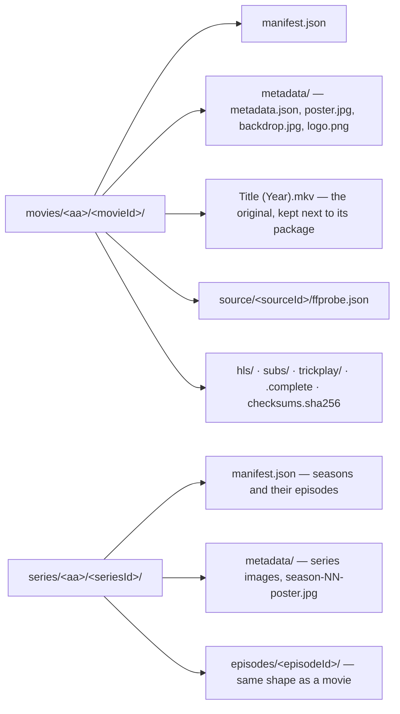
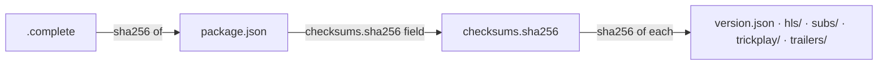

# schemas

Published contracts for the zaentrum platform, in two families:

- **Event payloads** — Avro schemas for Kafka events, the single source of
  truth for event shapes, published to a shared Apicurio schema registry.
- **Library storage** — JSON Schemas for the on-storage library, served at
  <https://zaentrum.github.io/schemas/>, in two versions: [v1](#library-storage-schemas), where
  storage is the source of truth and every item is a `manifest.json` plus a
  `metadata/metadata.json`, and [v2](#library-storage-schemas--v2), where the database is the
  working copy and the tree is a written-once record that can rebuild it.

## Status

The Avro schemas cover five event domains: library item lifecycle, transcode
processing, playback sessions, download-gateway adapters, and push-notification
fan-out. The library storage schemas are a draft; see their changelog below.

## Layout

```
stube/
  library/    item lifecycle events (created/updated/deleted)
  processing/ transcoder task + result events
  playback/   session lifecycle from chino-stream / tv-stream / musig-stream
  download/   download-gateway adapter completion events
  notify/     fan-out push notification requests
library/v1/
  manifest.schema.json, metadata.schema.json, defs.schema.json
  examples/                a movie and a series in the storage layout
library/v2/
  item.schema.json, metadata.schema.json, person.schema.json, source.schema.json,
  version.schema.json, package.schema.json, event.schema.json, defs.schema.json
  examples/                a movie, a series, a deletion and the people they credit
tools/
  publish-to-apicurio.sh           publish Avro schemas to a registry
  validate-library.py              validate a v1 library tree
  test-validate-library.py         broken v1 trees the validator must reject
  library-migrate.py               reference migrator from a legacy catalog
  make-library-examples.py         regenerate library/v1/examples
  package-checksums.py             write or verify each package's checksums on storage
  validate-library-v2.py           validate a v2 library tree
  test-validate-library-v2.py      broken v2 trees the validator must reject
  make-library-v2-examples.py      regenerate library/v2/examples
  library-v2-from-catalog.py       write v2 records for a catalog's items
  library-v2-from-v1.py            convert v1 item folders into v2 records
  library-v2-rebuild.py            the catalog contents a v2 tree implies
  library-v2-media-check.py        check a v2 tree against the bytes, without jsonschema
  library-v2-upgrade.py            upgrade a v2 tree in place to the layout in which every record proves itself
  library-v2-sweep.py              find provable garbage in a v2 tree and, through a quarantine, remove it
  test-library-v2-tools.py         prove the v2 tools do what they say
```

The top-level `stube/` directory mirrors the Avro namespace and Kafka topic
prefix (`stube.<domain>`); it is an operational name and is kept as-is.

## Naming convention

- Topic: `stube.<domain>.<event>` (e.g. `stube.library.item.created`).
- Avro namespace: `stube.<domain>` (mirrors directory).
- Avro record name: `PascalCase` (`ItemCreated`, `TaskTranscode`).
- Artifact id in the registry: dot-joined path without extension
  (e.g. `stube.library.item-created`).

## Local development

Validate every schema parses as JSON:

```bash
find stube -name '*.avsc' -print0 | xargs -0 -I{} python -c "import json,sys; json.load(open('{}'))"
```

Or, if you have `avro-tools`:

```bash
find stube -name '*.avsc' -exec avro-tools compile schema {} /tmp/avro-gen \;
```

## Publishing

`tools/publish-to-apicurio.sh` walks every `.avsc` and publishes it to an
Apicurio registry. Point it at your own registry via environment variables:

```bash
APICURIO_URL=https://apicurio.example/ GROUP_ID=zaentrum ./tools/publish-to-apicurio.sh
```

## Library storage schemas

`library/` holds JSON Schemas (draft 2020-12) for the platform's on-storage
library, where storage is the source of truth and databases would be caches
built by reading it. The format is ahead of the code: no platform service reads
or writes it yet. Every item is a folder with two documents:

| Document | What it holds |
|---|---|
| `manifest.json` | The entry point. What the item is (type, primary title, reference ids), the playback fields a streaming service reads (unchanged from the version 2 package manifest), and for every version of a movie or episode what the original file contained and what the package carries and lost. |
| `metadata/metadata.json` | Every text (localised titles, overviews, credits, dates, series and season details) and the list of images, which sit in the same `metadata/` folder. A re-sync from the reference database would rewrite only this file. |

Layout on storage:


```mermaid
flowchart LR
  M["movies/&lt;aa&gt;/&lt;movieId&gt;/"] --> MM["manifest.json"]
  M --> MD["metadata/ — metadata.json, poster.jpg, backdrop.jpg, logo.png"]
  M --> MO["Title (Year).mkv — the original, kept next to its package"]
  M --> MS["source/&lt;sourceId&gt;/ffprobe.json"]
  M --> MP["hls/ · subs/ · trickplay/ · .complete · checksums.sha256"]
  S["series/&lt;aa&gt;/&lt;seriesId&gt;/"] --> SM["manifest.json — seasons and their episodes"]
  S --> SD["metadata/ — series images, season-NN-poster.jpg"]
  S --> E["episodes/&lt;episodeId&gt;/ — same shape as a movie"]
```

`<aa>` is the first two hex characters of the id. Folders are keyed only by
stable ids, never by titles or numbers, so a rename, renumbering or alternate
episode order never moves a file. A second version of a movie or episode
(a director's cut, a black-and-white presentation) is stored in
`versions/<versionId>/` inside the item folder with its own playback block.

Validate a tree (schemas plus the cross-file rules: ids match folders, images
match their hashes, a series lists exactly its episode folders):

```sh
pip install "jsonschema[format-nongpl]>=4.23" referencing
python tools/validate-library.py <root-with-movies-and-series>
python tools/validate-library.py --check-media <root>    # also require every playback path to exist
python tools/test-validate-library.py                    # prove the validator rejects broken trees
```

`tools/library-migrate.py` is a reference migrator that builds item folders
from a legacy catalog export plus probe output. A value the export does not
hold stays empty rather than guessed, and where automation cannot decide it
records a `review` for a person. `tools/make-library-examples.py` regenerates
`library/v1/examples`.

### Library v1 changelog

v1 is a draft until a platform service adopts it. Every change is listed here;
rebuild a library with the current migrator after one.

- **2026-09-14 (e)** — the series category folder is `series/`, matching `type:
  series` and `seriesId` (was `shows/`). No views and no links: the migrator's
  plan moves files into place and `--check-media` rejects hard links.
- **2026-09-14 (d)** — a version's folder is the one destination of its media:
  the source record's `file.path` names the original file placed next to the
  package (null while it is still only in the source library, and after
  deletion). The validator checks its size and qh1 with `--check-media`, and the
  migrator plans to link or move originals into their version folders.
- **2026-09-14 (c)** — `chapters`, `chaptersFrom` and `segments` (intro, recap,
  credits) move from the source record to the version; the package loses
  `chapters` and the `chapters-dropped` loss, since the version keeps the marks;
  packages gain `checksums` (a `checksums.sha256` file per version folder,
  computed on storage by `tools/package-checksums.py`). The validator checks
  trickplay sprite sheets against the VTT and package files against their
  checksums.
- **2026-09-14 (b)** — behaviour is not library data: `package.decisions`
  (default audio and subtitle), audio `forcedSubtitle` and source
  `subtitleDecisions` are removed. Players and per-user settings derive them from
  `purpose` and language. The version 2 `default`, `forced` and `visible` fields
  stay as playback hints for existing readers.
- **2026-09-14 (a)** — no schema change; the migrator reports package audio titles
  that claim more than the rendition carries, and interchangeable or
  indistinguishable audio renditions, for building track menus.
- **2026-09-13 (e)** — renditions require `purpose` and `purposeFrom`;
  `purposeFrom` gains `content` (a forced track recognised by its small number of
  events); subtitle streams record `events`; audio streams and renditions gain
  `variant`; stream `dispositions` hold only the file's own flags; a
  `forcedSubtitle` must be in its audio's language, and a forced track may not be
  flagged default.
- **2026-09-13 (d)** — audio and subtitle tracks record their `purpose`
  (subtitles: `dialogue`, `sdh`, `forced`, `signs-songs`, `commentary`, `lyrics`;
  audio: `main`, `commentary`, `description`) and `purposeFrom`; audio renditions
  gain `original` and `forcedSubtitle`, the forced track shown while subtitles
  are off; subtitle renditions gain `variant`; video streams record
  `closedCaptions`; essence gains SDH and forced subtitle languages, commentary
  subtitles, audio description tracks and closed captions; losses gain
  `closed-captions-dropped`.
- **2026-09-13 (c)** — `package.peakBandwidthBps` replaces `package.bitrateBps`
  (the value is a playlist peak, not an average); timestamps require an
  upper-case `T` and `Z`; `version` must be the integer 3; `probe.at` may be
  null; an episode listing path must be `episodes/<id>/`.
- **2026-09-13 (b)** — source `labels.medium` replaces `releaseSource`,
  `proper` and `revision`; version paths must be `.` or `versions/<id>/`;
  rendition languages follow the language rule; `packagedAt` is a timestamp;
  a series carries no playback fields; packages gain `sizeBytes`; metadata gains
  `videos[]`, season `tmdbSeason` and the `folder-name` origin.
- **2026-09-13 (a)** — `manifest.json` and `metadata/metadata.json` replace the
  four-document layout (`work`, `version`, `source`, `package`).

The format is documented in the
[zaentrum wiki](https://github.com/zaentrum/zaentrum/wiki/library).

## Library storage schemas — v2

v2 turns v1 around. The **database is the working copy**: services read and write it at runtime,
and nothing walks the tree to answer a request. **Storage is the record**: every item folder holds
the facts about itself as they were when they were made — its identity, each original that entered
it, each version and package produced from it, and the texts and images the database held — which
is enough to rebuild the database and nothing more. There is no crawler; the tree is read on two
occasions only, a deliberate rebuild and a deliberate verification.

That makes every file single-writer and one-directional, which is why there is no `manifest.json`
any more and no `rev`, `updatedAt` or `review` anywhere. A file is either a record of something
that cannot change — `item.json`, `sources/<id>/source.json`, `versions/<id>/version.json`,
`versions/<id>/package.json`, `events/<…>/event.json` — written once when the thing it describes is
made and never touched again, or a projection of the database (`metadata.json`, and `person.json` for
a person), replaced whole by the service that owns it. **A fact about the bytes is a record; a decision the database holds is a projection**, so
what an original contained and what a package lost are written once, while which version plays by
default, what a viewer's version picker says, how far to trust the reference ids and how the
episodes are ordered live in `metadata.json` under `library`. Nothing is merged, so there is no
conflict to resolve. The few facts that arise later get their own folder under `events/` instead of
a rewrite: an original deleted, a version removed, a package superseded. Every version is a folder, so
a re-package is a new folder rather than an edit, and a record always sits next to the bytes it
describes.

```
movies/<aa>/<itemId>/
  item.json                        identity, written once
  checksums.sha256                 covers item.json, written with it
  metadata.json                    the database's texts, projected
  metadata/<sha256>.jpg            images named by their own content hash
  sources/<sourceId>/
    source.json                    one original as it was found, written once
    ffprobe.json                   the verbatim probe, and each copied sidecar beside it
    checksums.sha256               covers the files above, written with them
  versions/<versionId>/
    version.json                   edition, presentation, marks, sources — written once
    <original file>                the original, when this version keeps it
    hls/  subs/  trickplay/        the package
    checksums.sha256               version.json and every package file, sha256sum -c format
    package.json                   renditions, losses, and the hash of checksums.sha256
    .complete                      the hash of package.json: the version is finished
  events/<timestamp>-<eventId8>-<kind>/
    event.json                     a fact that arose later, written once
    checksums.sha256               covers event.json, written with it
series/<aa>/<seriesId>/            item.json, checksums.sha256, metadata.json, metadata/,
                                   episodes/<episodeId>/
people/<aa>/<personId>/
  person.json                      the database's person, projected
  <sha256>.jpg                     the portraits it lists, named by their own content hash
```

**People are a category of their own.** A credit carries only a `personId` and a name, and people
are shared by every item that credits them, so a person's biography, dates, reference ids and
portraits live once, in `people/<aa>/<personId>/person.json` beside `movies/` and `series/`, with the
same id-based folder and shard. Like `metadata.json` it is a projection, replaced whole by the one
service that owns people, so a rebuild restores every person as the last projection left them. It
lists no credits — those are the items' own, by `personId` — and a credit whose person has no folder
yet is a note, not an error: the person may simply not have been projected.

| Schema | Document | `schema` field |
|---|---|---|
| [`item.schema.json`](https://zaentrum.github.io/schemas/library/v2/item.schema.json) | `item.json` | `zaentrum.library.item/2` |
| [`metadata.schema.json`](https://zaentrum.github.io/schemas/library/v2/metadata.schema.json) | `metadata.json` | `zaentrum.library.metadata/2` |
| [`person.schema.json`](https://zaentrum.github.io/schemas/library/v2/person.schema.json) | `people/<aa>/<personId>/person.json` | `zaentrum.library.person/2` |
| [`source.schema.json`](https://zaentrum.github.io/schemas/library/v2/source.schema.json) | `sources/<sourceId>/source.json` | `zaentrum.library.source/2` |
| [`version.schema.json`](https://zaentrum.github.io/schemas/library/v2/version.schema.json) | `versions/<versionId>/version.json` | `zaentrum.library.version/2` |
| [`package.schema.json`](https://zaentrum.github.io/schemas/library/v2/package.schema.json) | `versions/<versionId>/package.json` | `zaentrum.library.package/2` |
| [`event.schema.json`](https://zaentrum.github.io/schemas/library/v2/event.schema.json) | `events/<timestamp>-<eventId8>-<kind>/event.json` | `zaentrum.library.event/2` |
| [`defs.schema.json`](https://zaentrum.github.io/schemas/library/v2/defs.schema.json) | shared definitions | — |

### A record proves itself

The records a rebuild trusts are covered by checksums written with them, in the folder they sit in,
so `sha256sum -c checksums.sha256` in any folder written once proves its records are the bytes that
were written — with no database and no network:

| Folder | Its `checksums.sha256` lists | Written |
|---|---|---|
| `movies/<aa>/<itemId>/`, `series/…`, `episodes/<id>/` | exactly `item.json` | with `item.json`, once |
| `sources/<sourceId>/` | exactly `source.json`, the probe and the sidecars | with them, once |
| `events/<…>/` | exactly `event.json` | with it, once |
| `versions/<versionId>/` | `version.json` and every package file | by the packager, when the package completes |

A version is the one folder written in two steps: the analyzer writes `version.json`, and the
packager closes the chain when the package completes — the checksums over `version.json` and every
package file, then `package.json` with the hash of the checksums file, then `.complete` holding
`sha256:<hex>` of `package.json`, and nothing else. One hash then proves the whole version:


```mermaid
flowchart LR
  DONE[".complete"] -->|"sha256 of"| PKG["package.json"]
  PKG -->|"checksums.sha256 field"| SUMS["checksums.sha256"]
  SUMS -->|"sha256 of each"| FILES["version.json · hls/ · subs/ · trickplay/ · trailers/"]
```

The checksums file therefore never lists `.complete`, `package.json` or itself — each holds the hash
of the link below it — and it never lists the originals, which their source records' fixity covers
and which may be deleted later. A version that has no package yet has no checksums file, and its
`version.json` is covered from the moment its package completes. **Projections are not covered, on
purpose**: `metadata.json` and `person.json` are replaced whole, so a checksum written with one would
be wrong after the next, and every image is named by the hash of its own bytes, so its name is its
check.

### Applying events

The records describe things that cannot change, so a reader — a rebuild, a verify, a player's
catalog — reads an item's records first and then applies its `events/` in order of `at`, earliest
first. Four kinds, and what each one changes:

| Kind | Effect |
|---|---|
| `original-deleted` | The originals it names are gone from the version folder: the source it names, or all of them when it names none. Once none is left, that version's package is the only copy of it — canonical, whatever `role` its record was written with — and everything the package failed to carry is permanent. |
| `version-removed` | The version is no longer part of the item. Ignore its folder even when it is still on storage: its package is not playable, and nothing may point at it. |
| `package-superseded` | The package it names is no longer the one to use; the package under `supersededBy` is authoritative for its version from that moment. The superseded folder stays exactly as it was. |
| `note` | Nothing. It is something a person recorded that no other record holds. |

The **deletion gate** — what deleting a version's originals would cost — is not recorded anywhere.
A reader computes it as the essence of the version's sources minus the essence of its package, so it
stays right however often the version is re-packaged, and a version with an original and nothing
packaged can still answer it. The only fact is a person's answer: `accepted` on an `original-deleted`
event, named in essence terms (`surround`, `maxAudioChannels`, `subtitleLanguages:en`). It is a
subset of the gate and not necessarily all of it, because someone who measures again before deleting
may accept less.

Validate a tree (the schemas plus the rules that span files: ids match their folders, no media
outside a version folder, every write-once folder's checksums cover exactly its records and each
version's chain holds, `package.json` exists exactly when `.complete` does, images are named by their
own hash, events reference records that exist and a deletion accepts no more than the gate its
records compute, episodes do not contradict their own numbering, a person folder holds its record and
the images it lists):

```sh
pip install "jsonschema[format-nongpl]>=4.23" referencing
python tools/validate-library-v2.py <root-with-movies-and-series>
python tools/validate-library-v2.py --check-media <root>      # also the bytes the records name
python tools/validate-library-v2.py --check-checksums <root>  # also hash every package file
python tools/test-validate-library-v2.py                      # prove it rejects broken trees
python tools/make-library-v2-examples.py                      # regenerate library/v2/examples
```

### Writing and reading a tree

These tools put the record on storage, read it back and keep it. They are plain standard-library Python 3.11
and need no network, so they run where the share is mounted — piped into a pod if that is the only
place it is reachable (`oc exec -i deploy/packager -- python3 - <args> < tool.py`). The database
export they read is produced on the client side, so nothing needs a driver or a credential.

```sh
# a catalog's rows, its package store and its originals become item folders, and its people folders
python tools/library-v2-from-catalog.py --export catalog.json --packages /…/packages \
       --media /…/media --out /…/library [--items id,id] [--media-mode copy|move|none] [--dry-run]

# only the people, into a tree written earlier: no item record is touched
python tools/library-v2-from-catalog.py --export catalog.json --out /…/library --people-only [--dry-run]

# v1 item folders (manifest.json + metadata/) become v2 records, in place or into a new tree
python tools/library-v2-from-v1.py --in /…/library --in-place [--dry-run]

# the catalog contents a tree implies, with its events applied, and both directions against an export
python tools/library-v2-rebuild.py /…/library --out rows.json [--compare catalog.json [--subset]]

# the checks that must run where the files are: they need no jsonschema
python tools/library-v2-media-check.py /…/library [--checksums]

# a tree written before 2026-10-02 (b), brought to the layout in which every record proves itself
python tools/library-v2-upgrade.py /…/library [--dry-run] [--verbose]

# what a writer left behind that the records prove is garbage: listed, and with --apply removed
python tools/library-v2-sweep.py /…/library [--export catalog.json] [--grace 24h] [--apply] [--verbose]

python tools/test-library-v2-tools.py   # prove every one of them does what it says
```

`library-v2-upgrade.py` moves each `sources/<id>.json` and `events/<…>.json` into a folder of its own,
writes every write-once folder's checksums, and closes each finished version's chain; it changes no
record's content, reads no media — a package file's digest is carried forward from the checksums the
packager wrote, so a file that changed since stays caught — and leaves anything that contradicts its
records exactly as it was, as a conflict it reports. A run stopped anywhere is finished by the next,
and a second run changes nothing. It writes no `people/`: `library-v2-from-catalog.py --people-only`
adds those to an upgraded tree.

A rebuilt catalog is only as complete as the record: the tree holds no per-user state and no row
modification times, the paths it hands back are the version folders the bytes moved into, and what
a source record could not be told (an original that is already gone, a file nothing probed) stays
empty rather than guessed.

### Telling an orphan from a loss

Deleting an item deletes its folder — that is the writer's obligation, and a writer that misses it
leaves a record the database does not know. Seen from the tree alone, such a folder could be an item
the database **deleted** (remove the folder) or one it **lost** (restore it), and only the database
can say which. So the catalog export carries the database's deletion log, beside its rows:

```json
{ "exportedAt": "…", "items": [ … ], "deletedItems": [ { "id": "<itemId>", "deletedAt": "<RFC 3339>", "deletedBy": "<who>" } ] }
```

`library-v2-rebuild.py --compare` sorts every item that exists on one side only into one of three
classes, each listed with its ids:

| Class | What it means | Fails the compare |
|---|---|---|
| orphan | On storage, not in the database, in the deletion log, and nothing in its folder is newer than that deletion: the database deleted it, and the folder is safe to remove. An episode whose series was deleted is an orphan with it. | no |
| lost | On storage and not in the database, but not in the log either — or in the log while a record in the folder is newer than the deletion, because the id was created again since: the database lost what the record still knows, a restore candidate. | yes |
| missing record | In the database, not on storage: the tree cannot restore it. Not counted with `--subset`. | yes |

*Nothing newer* is the newest moment any record in the folder states — `item.json`'s `createdAt` and
`migratedAt`, `metadata.json`'s `asOf`, every source's `takenAt`, version's and package's `createdAt`
and event's `at`, and for a series its episodes' as well — and a record that states none counts with
its file's modification time, so a folder never looks older than what is in it. An id that is in the
log and in the database is present: the item that exists wins, and the log entry describes an
earlier life. When `deletedItems` is `null` — a catalog that keeps no log yet — or absent, nothing
can be called deleted, and every item only on storage is lost. `[]` is a log that says nothing was
deleted. A field that disagrees between two rows both sides hold fails the compare too.

People are compared as well. The database's people are the export's top-level `people` list when it
carries one, and otherwise everyone its items credit — a `personId` and a name, which is all a catalog
without person records knows — and only the fields the export carries are compared. The deletion log
holds items only, so a person is never an orphan and never swept: a person only on storage is *lost*
when an item on storage that is lost, or that the database holds, credits them, and *unreferenced* —
listed, kept, not a failure — when nothing the database holds credits them.

### Sweeping what a writer missed

Nothing walks the tree on its own, so garbage a writer leaves stays until someone collects it.
`library-v2-sweep.py` finds what the records and the database prove is garbage, lists it with the
reason, and with `--apply` removes it:

| What | Proved by |
|---|---|
| a deleted item's folder | the export's deletion log names the id, the database does not hold it again, no record in the folder — episodes included — is newer than the deletion, and the deletion is older than the grace |
| an unfinished version | no `.complete`, and either no `version.json` (nothing can have known it), or no original kept and nothing names it — not `metadata.json`, not an event other than its removal, not the export; a version that keeps an original loses only the unfinished package beside it |
| a dropped image | named by the hash of its own bytes, in an item's `metadata/` or beside a `person.json`, and not listed by a projection that is itself older than the grace |

Everything must be older than the grace period (`--grace 24h` by default), because a write in flight
looks exactly like garbage: a record is written before its database row, and an image before the
projection that lists it. It never touches anything referenced, anything younger than the grace,
anything it cannot classify, or a person's folder — the deletion log holds items only — and it lists
what it left alone and why. Without `--export`, or with a `deletedItems` that is `null`, no item
folder is swept at all.

`--apply` renames every target into a quarantine at the library root, `_swept/<YYYYMMDDTHHMMSSZ>/`,
with a `sweep.json` that says where each came from — a rename on the same filesystem, never a copy.
It then reads the export, the projections and the events again, puts back anything referenced by
then, and only after that deletes the quarantine. A quarantine an interrupted `--apply` left behind
is finished by the next one; the validator names it until then. A file the validator would otherwise
call unlisted — an image a projection dropped — is a note for the sweep, not an error, and so is a
package that never finished.

### Library v2 changelog

v2 is a draft until a platform service adopts it. v1 stays published and unchanged; nothing
migrates automatically. Every change is listed here; regenerate the examples after one.

- **2026-10-02 (c)** — garbage, and telling an orphan from a loss. Deleting an item never removed its
  folder, and a rebuild could not tell a folder the database deleted from one it lost. The catalog
  export now carries the database's deletion log, `deletedItems: [{id, deletedAt, deletedBy}]` —
  `null` on a catalog that keeps none yet — and `library-v2-rebuild.py --compare` sorts every item
  only on storage into **orphan** (in the log, nothing in its folder newer than the deletion: safe
  to remove) or **lost** (anything else: restore it), and every item only in the database into
  **missing record**; only lost and missing fail it. People are never orphans: a person nothing the
  database holds credits is unreferenced and kept. `library-v2-sweep.py` is new: it finds the folders
  of orphans, version folders that never finished and images no projection lists, each older than a
  grace period, and with `--apply` removes them through a quarantine it checks again before deleting.
  Format: an image named by its own hash that a projection no longer lists is a validator note, not
  an error — it is what the sweep collects — and so is a package without its `.complete`; a
  `_swept/` quarantine at the root is reported until the next `--apply` finishes it.
- **2026-10-02 (b)** — the records themselves are protected. A version's `checksums.sha256` covered
  its package files but not `version.json` or `package.json`, the files a rebuild trusts. Now every
  folder written once carries the checksums of its records, written with them, so `sha256sum -c` in
  any of them proves it. The item folder gains `checksums.sha256`, listing exactly `item.json`.
  **Each source becomes a folder**, `sources/<sourceId>/`, holding `source.json` (it was
  `sources/<sourceId>.json`), the probe, the sidecars and a `checksums.sha256` over all of them; the
  probe and sidecar paths in the record are unchanged. **Each event becomes a folder**,
  `events/<YYYYMMDDTHHMMSSZ>-<eventId8>-<kind>/` holding `event.json` and a `checksums.sha256` over it —
  a checksums file shared by all of an item's events would change with each new one — and the first
  eight characters of the eventId are now always in the name, so two events never share a folder. A
  version's `checksums.sha256` additionally lists `version.json` and **no longer lists `.complete`**,
  which now holds `sha256:<hex>` of `package.json`: one chain, `.complete` → `package.json` →
  `checksums.sha256` → `version.json` and every package file, in which no link can be listed below
  itself. `checksums.files` and `checksums.bytes` count `version.json`; the package's `sizeBytes` still
  counts its own files only. Projections stay uncovered on purpose: they are replaced whole, and an
  image is named by its own hash. The validator and `library-v2-media-check.py` enforce every link,
  `library-v2-rebuild.py` still reads the old layout so a backup from before can be restored, and
  `library-v2-upgrade.py` upgrades a tree in place. Nothing had been adopted as published, so the
  layout could change.
- **2026-10-02 (a)** — people are recorded. A credit carried only a `personId` and a name, so a
  database loss took every biography and portrait with it. `person.schema.json` is new:
  `people/<aa>/<personId>/person.json` (`zaentrum.library.person/2`), a category beside `movies/` and
  `series/` with the same id and shard rules, holding the person as the database projects them —
  `name`, `sortName`, `alsoKnownAs`, `birthDate`, `deathDate`, `birthPlace`, `biography` keyed by
  language, `externalIds` (`tmdbPerson`, `imdb` as an `nm…` id, `tvdb`, `wikidata`), the portraits
  beside it (`kind: profile`), `curation` and `fieldOrigins` — and no credits, which stay the items'.
  The image object, `curation` and `fieldOrigins` move to `defs` so `metadata.json` and `person.json`
  share them; each document narrows the image `kind` to its own. A credit whose person has no record
  is a validator note, not an error. `library-v2-from-catalog.py` writes a record for every person
  the export credits (and every person a top-level `people` list holds), `--people-only` writes just
  those into an existing tree, and `library-v2-rebuild.py` restores and compares people rows.

- **2026-09-21 (c)** — the gate is computed, not recorded. `lostIfOriginalDeleted` is gone from both
  `version.json` and `package.json`: it is the sources' essence minus the package's, which a reader
  computes from the records beside it, and recording it on the version fought the write order (the
  analyzer writes `version.json` before the packager writes `package.json`). What stays is the fact —
  `accepted` on an `original-deleted` event — now named in essence terms and required only to be a
  **subset** of the gate, so someone who measures again and accepts less is not rejected. The
  series-level `library.orderings` map is gone too: `defaultOrdering` is a decision and stays, but the
  orderings themselves are the episodes' own `library.numbering`, which is the one place they are
  written; what is left to check is that an episode does not contradict the numbers its `item.json`
  was created with and that no two episodes of a series claim one place in one ordering.
  `source.json` gains `naming`, how the file's own name numbered what it holds (`S07E23-24`) — a fact
  about the bytes, and often the only record of how a release was numbered — and `item.json` gains
  `provenance` (`migratedFrom`, `legacyItemId`, `migratedAt`, `legacyCreatedBy`), so a tree built by
  migrating an old catalog keeps the old ids. `checksums.files` and `checksums.bytes` keep their v1
  names, which read as a pair; the metadata image field stays `sizeBytes`.
- **2026-09-21 (b)** — the decisions a rebuild could not recover. `metadata.json` gains `library`:
  `primaryVersionId` (which version plays when the viewer does not choose), `versionLabels`
  (versionId → the label a person set; every other version is labelled at read time from its edition
  and presentation), `match` (v1's matched / unmatched / manual / disputed, so a re-sync cannot
  overwrite a human decision), `reference` (v1's published runtime and where it came from), and for
  a series `defaultOrdering`, with each episode's place in every ordering under `numbering`,
  `episodeEnd` included. They are projections, not records: a changed decision replaces the file
  rather than editing anything written once. `version.json` gains `completeness`
  (complete / truncated / suspect, measured — a version nobody measured leaves it out) and replaces
  `originalFile` with `originalFiles`, an ordered array, so a version split across parts can say what
  is in its folder. `event.schema.json` gains
  the kind `version-removed`, so a deleted version folder leaves a trace, and `package-superseded`
  now carries `supersededBy` (versionId + packageId), so a reader never infers the successor from
  timestamps; the schema's description states the order and effect of applying events, and
  [Applying events](#applying-events) repeats it. The metadata image field `bytes` is `sizeBytes`,
  the word the rest of the format uses. `defs` gains `decidedBy` and `decision`, now shared by the
  version's edition and the projection's match.
- **2026-09-21 (a)** — first publication of the record layout, against
  [Database first, storage as the record](https://github.com/zaentrum/zaentrum/blob/main/docs/library/record.md).
  Against v1: `manifest.json` is split into `item.json`, `sources/<id>.json`,
  `versions/<id>/version.json` and `versions/<id>/package.json`; `metadata/metadata.json` moves up
  to `metadata.json` and its images are named by their content hash rather than by kind, so an
  image is written once and a replacement is a new file; `events/` is new. Every version is a
  folder, so `versions[].path` and the top-level playback fields are gone. `rev`, `audit`,
  `updatedAt`, `decision.review` and `match` are gone with the living documents they belonged to;
  the source's `state`/`deletedAt` and the package's `building`/`failed` states are gone with
  them — an unfinished package writes nothing, and a deletion is an event. `package.checksums` is
  required rather than nullable, because a record written on completion has nothing to fill in
  later. `defs` keeps v1's `uuid`, `sha256`, `timestamp`, `date`, `language`, `relPath`,
  `externalIds`, `fixity`, `essence`, `ownership` and `evidence`, and gains `fileName`,
  `subtitlePurpose`, `audioPurpose` and `purposeFrom`, which v1 kept inside `manifest.schema.json`
  and both the source and the package now share. Every playback field of the v1 manifest survives
  in `package.json` under its own name, except `packagedAt` and `packager`, which are `createdAt`
  and `packagedBy` like every other v2 record.

## License

[MPL-2.0](LICENSE).
